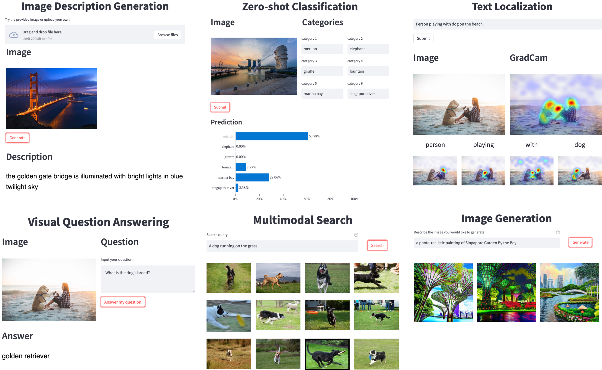

<p align="center">
    <br>
    
    <br>
<p>

<div align="center">
  <a href="https://github.com/salesforce/LAVIS/releases"></a>
  <a href="https://opensource.salesforce.com/LAVIS/index.html">
  
  <a href="https://opensource.org/licenses/BSD-3-Clause">
  
  </a> 
  <a href="https://pepy.tech/project/salesforce-lavis">
  
  </a>
</div>

<div align="center">
<a href="https://opensource.salesforce.com/LAVIS//latest/benchmark.html">Benchmark</a>,
<a href="https://arxiv.org/abs/2209.09019">Technical Report</a>,
<a href="https://opensource.salesforce.com/LAVIS//latest/index.html">Documentation</a>,
<a href="https://github.com/salesforce/LAVIS/tree/main/examples">Jupyter Notebook Examples</a>,
<a href="https://blog.salesforceairesearch.com/lavis-language-vision-library/">Blog</a>
</div>

# LAVIS - A Library for Language-Vision Intelligence

## What's New: 🎉 
  * [Model Release] November 2023, released implementation of **X-InstructBLIP** <br>
  [Paper](https://arxiv.org/pdf/2311.18799.pdf), [Project Page](https://github.com/salesforce/LAVIS/tree/main/projects/xinstructblip), [Website](https://artemisp.github.io/X-InstructBLIP-page/), [](https://colab.research.google.com/github/salesforce/LAVIS/blob/main/projects/xinstructblip/demo/run_demo.ipynb)
  > A simple, yet effective, cross-modality framework built atop frozen LLMs that allows the integration of various modalities (image, video, audio, 3D) without extensive modality-specific customization.
  * [Model Release] July 2023, released implementation of **BLIP-Diffusion** <br>
  [Paper](https://arxiv.org/abs/2305.06500), [Project Page](https://github.com/salesforce/LAVIS/tree/main/projects/blip-diffusion), [Website](https://dxli94.github.io/BLIP-Diffusion-website/)
  > A text-to-image generation model that trains 20x than DreamBooth. Also facilitates zero-shot subject-driven generation and editing.
  * [Model Release] May 2023, released implementation of **InstructBLIP** <br>
  [Paper](https://arxiv.org/abs/2305.06500), [Project Page](https://github.com/salesforce/LAVIS/tree/main/projects/instructblip)    
  > A new vision-language instruction-tuning framework using BLIP-2 models, achieving state-of-the-art zero-shot generalization performance on a wide range of vision-language tasks.
  * [Model Release] Jan 2023, released implementation of **BLIP-2** <br>
  [Paper](https://arxiv.org/abs/2301.12597), [Project Page](https://github.com/salesforce/LAVIS/tree/main/projects/blip2), [](https://colab.research.google.com/github/salesforce/LAVIS/blob/main/examples/blip2_instructed_generation.ipynb)
  > A generic and efficient pre-training strategy that easily harvests development of pretrained vision models and large language models (LLMs) for vision-language pretraining. BLIP-2 beats Flamingo on zero-shot VQAv2 (**65.0** vs **56.3**), establishing new state-of-the-art on zero-shot captioning (on NoCaps **121.6** CIDEr score vs previous best **113.2**). In addition, equipped with powerful LLMs (e.g. OPT, FlanT5), BLIP-2 also unlocks the new **zero-shot instructed vision-to-language generation** capabilities for various interesting applications!
  * Jan 2023, LAVIS is now available on [PyPI](https://pypi.org/project/salesforce-lavis/) for installation!
  * [Model Release] Dec 2022, released implementation of **Img2LLM-VQA** (**CVPR 2023**, _"From Images to Textual Prompts: Zero-shot VQA with Frozen Large Language Models"_, by Jiaxian Guo et al) <br>
  [Paper](https://arxiv.org/pdf/2212.10846.pdf), [Project Page](https://github.com/salesforce/LAVIS/tree/main/projects/img2llm-vqa), [](https://colab.research.google.com/github/salesforce/LAVIS/blob/main/projects/img2llm-vqa/img2llm_vqa.ipynb)
  > A plug-and-play module that enables off-the-shelf use of Large Language Models (LLMs) for visual question answering (VQA). Img2LLM-VQA surpasses Flamingo on zero-shot VQA on VQAv2 (61.9 vs 56.3), while in contrast requiring no end-to-end training! 
  * [Model Release] Oct 2022, released implementation of **PNP-VQA** (**EMNLP Findings 2022**, _"Plug-and-Play VQA: Zero-shot VQA by Conjoining Large Pretrained Models with Zero Training"_, by Anthony T.M.H. et al), <br> 
  [Paper](https://arxiv.org/abs/2210.08773), [Project Page](https://github.com/salesforce/LAVIS/tree/main/projects/pnp-vqa), [](https://colab.research.google.com/github/salesforce/LAVIS/blob/main/projects/pnp-vqa/pnp_vqa.ipynb))
  >  A modular zero-shot VQA framework that requires no PLMs training, achieving SoTA zero-shot VQA performance. 

## Technical Report and Citing LAVIS
You can find more details in our [technical report](https://arxiv.org/abs/2209.09019).

**If you're using LAVIS in your research or applications, please cite it using this BibTeX**:
```bibtex
@inproceedings{li-etal-2023-lavis,
    title = "{LAVIS}: A One-stop Library for Language-Vision Intelligence",
    author = "Li, Dongxu  and
      Li, Junnan  and
      Le, Hung  and
      Wang, Guangsen  and
      Savarese, Silvio  and
      Hoi, Steven C.H.",
    booktitle = "Proceedings of the 61st Annual Meeting of the Association for Computational Linguistics (Volume 3: System Demonstrations)",
    month = jul,
    year = "2023",
    address = "Toronto, Canada",
    publisher = "Association for Computational Linguistics",
    url = "https://aclanthology.org/2023.acl-demo.3",
    pages = "31--41",
    abstract = "We introduce LAVIS, an open-source deep learning library for LAnguage-VISion research and applications. LAVIS aims to serve as a one-stop comprehensive library that brings recent advancements in the language-vision field accessible for researchers and practitioners, as well as fertilizing future research and development. It features a unified interface to easily access state-of-the-art image-language, video-language models and common datasets. LAVIS supports training, evaluation and benchmarking on a rich variety of tasks, including multimodal classification, retrieval, captioning, visual question answering, dialogue and pre-training. In the meantime, the library is also highly extensible and configurable, facilitating future development and customization. In this technical report, we describe design principles, key components and functionalities of the library, and also present benchmarking results across common language-vision tasks.",
}
```


## Table of Contents
  - [Introduction](#introduction)
  - [Installation](#installation)
  - [Getting Started](#getting-started)
    - [Model Zoo](#model-zoo)
    - [Image Captioning](#image-captioning)
    - [Visual question answering (VQA)](#visual-question-answering-vqa)
    - [Unified Feature Extraction Interface](#unified-feature-extraction-interface)
    - [Load Datasets](#load-datasets)
  - [Jupyter Notebook Examples](#jupyter-notebook-examples)
  - [Resources and Tools](#resources-and-tools)
  - [Documentations](#documentations)
  - [Ethical and Responsible Use](#ethical-and-responsible-use)
  - [Technical Report and Citing LAVIS](#technical-report-and-citing-lavis)
  - [License](#license)

## Introduction
LAVIS is a Python deep learning library for LAnguage-and-VISion intelligence research and applications. This library aims to provide engineers and researchers with a one-stop solution to rapidly develop models for their specific multimodal scenarios, and benchmark them across standard and customized datasets.
It features a unified interface design to access
- **10+** tasks
(retrieval, captioning, visual question answering, multimodal classification etc.);
- **20+** datasets (COCO, Flickr, Nocaps, Conceptual
Commons, SBU, etc.);
- **30+** pretrained weights of state-of-the-art foundation language-vision models and their task-specific adaptations, including [ALBEF](https://arxiv.org/pdf/2107.07651.pdf),
[BLIP](https://arxiv.org/pdf/2201.12086.pdf), [ALPRO](https://arxiv.org/pdf/2112.09583.pdf), [CLIP](https://arxiv.org/pdf/2103.00020.pdf).
<p align="center">
    <br>
    
    <br>
<p>

Key features of LAVIS include:

- **Unified and Modular Interface**: facilitating to easily leverage and repurpose existing modules (datasets, models, preprocessors), also to add new modules.

- **Easy Off-the-shelf Inference and Feature Extraction**: readily available pre-trained models let you take advantage of state-of-the-art multimodal understanding and generation capabilities on your own data.

- **Reproducible Model Zoo and Training Recipes**: easily replicate and extend state-of-the-art models on existing and new tasks.

- **Dataset Zoo and Automatic Downloading Tools**: it can be a hassle to prepare the many language-vision datasets. LAVIS provides automatic downloading scripts to help prepare a large variety of datasets and their annotations.


The following table shows the supported tasks, datasets and models in our library. This is a continuing effort and we are working on further growing the list.

|                  Tasks                   |     Supported Models     |             Supported Datasets             |
| :--------------------------------------: | :----------------------: | :----------------------------------------: |
|         Image-text Pre-training          |       ALBEF, BLIP        | COCO, VisualGenome, SBU ConceptualCaptions |
|           Image-text Retrieval           |    ALBEF, BLIP, CLIP     |              COCO, Flickr30k               |
|           Text-image Retrieval           |    ALBEF, BLIP, CLIP     |              COCO, Flickr30k               |
|        Visual Question Answering         |       ALBEF, BLIP        |           VQAv2, OKVQA, A-OKVQA            |
|             Image Captioning             |           BLIP           |                COCO, NoCaps                |
|           Image Classification           |           CLIP           |                  ImageNet                  |
| Natural Language Visual Reasoning (NLVR) |       ALBEF, BLIP        |                   NLVR2                    |
|          Visual Entailment (VE)          |          ALBEF           |                  SNLI-VE                   |
|             Visual Dialogue              |           BLIP           |                  VisDial                   |
|           Video-text Retrieval           |       BLIP, ALPRO        |               MSRVTT, DiDeMo               |
|           Text-video Retrieval           |       BLIP, ALPRO        |               MSRVTT, DiDeMo               |
|    Video Question Answering (VideoQA)    |       BLIP, ALPRO        |                MSRVTT, MSVD                |
|              Video Dialogue              |         VGD-GPT          |                    AVSD                    |
|      Multimodal Feature Extraction       | ALBEF, CLIP, BLIP, ALPRO |                 customized                 |
|         Text-to-image Generation         |      [COMING SOON]       |                                            |

## Installation

1. (Optional) Creating conda environment

```bash
conda create -n lavis python=3.8
conda activate lavis
```

2. install from [PyPI](https://pypi.org/project/salesforce-lavis/)
```bash
pip install salesforce-lavis
```
    
3. Or, for development, you may build from source

```bash
git clone https://github.com/salesforce/LAVIS.git
cd LAVIS
pip install -e .
```

## Getting Started
### Model Zoo
Model zoo summarizes supported models in LAVIS, to view:
```python
from lavis.models import model_zoo
print(model_zoo)
# ==================================================
# Architectures                  Types
# ==================================================
# albef_classification           ve
# albef_feature_extractor        base
# albef_nlvr                     nlvr
# albef_pretrain                 base
# albef_retrieval                coco, flickr
# albef_vqa                      vqav2
# alpro_qa                       msrvtt, msvd
# alpro_retrieval                msrvtt, didemo
# blip_caption                   base_coco, large_coco
# blip_classification            base
# blip_feature_extractor         base
# blip_nlvr                      nlvr
# blip_pretrain                  base
# blip_retrieval                 coco, flickr
# blip_vqa                       vqav2, okvqa, aokvqa
# clip_feature_extractor         ViT-B-32, ViT-B-16, ViT-L-14, ViT-L-14-336, RN50
# clip                           ViT-B-32, ViT-B-16, ViT-L-14, ViT-L-14-336, RN50
# gpt_dialogue                   base
```

Let’s see how to use models in LAVIS to perform inference on example data. We first load a sample image from local.

```python
import torch
from PIL import Image
# setup device to use
device = torch.device("cuda" if torch.cuda.is_available() else "cpu")
# load sample image
raw_image = Image.open("docs/_static/merlion.png").convert("RGB")
```

This example image shows [Merlion park](https://en.wikipedia.org/wiki/Merlion) ([source](https://theculturetrip.com/asia/singapore/articles/what-exactly-is-singapores-merlion-anyway/)), a landmark in Singapore.


### Image Captioning
In this example, we use the BLIP model to generate a caption for the image. To make inference even easier, we also associate each
pre-trained model with its preprocessors (transforms), accessed via ``load_model_and_preprocess()``.

```python
import torch
from lavis.models import load_model_and_preprocess
device = torch.device("cuda" if torch.cuda.is_available() else "cpu")
# loads BLIP caption base model, with finetuned checkpoints on MSCOCO captioning dataset.
# this also loads the associated image processors
model, vis_processors, _ = load_model_and_preprocess(name="blip_caption", model_type="base_coco", is_eval=True, device=device)
# preprocess the image
# vis_processors stores image transforms for "train" and "eval" (validation / testing / inference)
image = vis_processors["eval"](raw_image).unsqueeze(0).to(device)
# generate caption
model.generate({"image": image})
# ['a large fountain spewing water into the air']
```

### Visual question answering (VQA)
BLIP model is able to answer free-form questions about images in natural language.
To access the VQA model, simply replace the ``name`` and ``model_type`` arguments
passed to ``load_model_and_preprocess()``.

```python
from lavis.models import load_model_and_preprocess
model, vis_processors, txt_processors = load_model_and_preprocess(name="blip_vqa", model_type="vqav2", is_eval=True, device=device)
# ask a random question.
question = "Which city is this photo taken?"
image = vis_processors["eval"](raw_image).unsqueeze(0).to(device)
question = txt_processors["eval"](question)
model.predict_answers(samples={"image": image, "text_input": question}, inference_method="generate")
# ['singapore']
```

### Unified Feature Extraction Interface

LAVIS provides a unified interface to extract features from each architecture. 
To extract features, we load the feature extractor variants of each model.
The multimodal feature can be used for multimodal classification.
The low-dimensional unimodal features can be used to compute cross-modal similarity.


```python
from lavis.models import load_model_and_preprocess
model, vis_processors, txt_processors = load_model_and_preprocess(name="blip_feature_extractor", model_type="base", is_eval=True, device=device)
caption = "a large fountain spewing water into the air"
image = vis_processors["eval"](raw_image).unsqueeze(0).to(device)
text_input = txt_processors["eval"](caption)
sample = {"image": image, "text_input": [text_input]}

features_multimodal = model.extract_features(sample)
print(features_multimodal.multimodal_embeds.shape)
# torch.Size([1, 12, 768]), use features_multimodal[:,0,:] for multimodal classification tasks

features_image = model.extract_features(sample, mode="image")
features_text = model.extract_features(sample, mode="text")
print(features_image.image_embeds.shape)
# torch.Size([1, 197, 768])
print(features_text.text_embeds.shape)
# torch.Size([1, 12, 768])

# low-dimensional projected features
print(features_image.image_embeds_proj.shape)
# torch.Size([1, 197, 256])
print(features_text.text_embeds_proj.shape)
# torch.Size([1, 12, 256])
similarity = features_image.image_embeds_proj[:,0,:] @ features_text.text_embeds_proj[:,0,:].t()
print(similarity)
# tensor([[0.2622]])
```

### Load Datasets
LAVIS inherently supports a wide variety of common language-vision datasets by providing [automatic download tools](https://opensource.salesforce.com/LAVIS//latest/benchmark) to help download and organize these datasets. After downloading, to load the datasets, use the following code:

```python
from lavis.datasets.builders import dataset_zoo
dataset_names = dataset_zoo.get_names()
print(dataset_names)
# ['aok_vqa', 'coco_caption', 'coco_retrieval', 'coco_vqa', 'conceptual_caption_12m',
#  'conceptual_caption_3m', 'didemo_retrieval', 'flickr30k', 'imagenet', 'laion2B_multi',
#  'msrvtt_caption', 'msrvtt_qa', 'msrvtt_retrieval', 'msvd_caption', 'msvd_qa', 'nlvr',
#  'nocaps', 'ok_vqa', 'sbu_caption', 'snli_ve', 'vatex_caption', 'vg_caption', 'vg_vqa']
```
After downloading the images, we can use ``load_dataset()`` to obtain the dataset.
```python
from lavis.datasets.builders import load_dataset
coco_dataset = load_dataset("coco_caption")
print(coco_dataset.keys())
# dict_keys(['train', 'val', 'test'])
print(len(coco_dataset["train"]))
# 566747
print(coco_dataset["train"][0])
# {'image': <PIL.Image.Image image mode=RGB size=640x480>,
#  'text_input': 'A woman wearing a net on her head cutting a cake. ',
#  'image_id': 0}
```

If you already host a local copy of the dataset, you can pass in the ``vis_path`` argument to change the default location to load images.

```python
coco_dataset = load_dataset("coco_caption", vis_path=YOUR_LOCAL_PATH)
```

## Jupyter Notebook Examples
See [examples](https://github.com/salesforce/LAVIS/tree/main/examples) for more inference examples, e.g. captioning, feature extraction, VQA, GradCam, zeros-shot classification.

## Resources and Tools
- **Benchmarks**: see [Benchmark](https://opensource.salesforce.com/LAVIS//latest/benchmark) for instructions to evaluate and train supported models.
- **Dataset Download and Browsing**: see [Dataset Download](https://opensource.salesforce.com/LAVIS//latest/benchmark) for instructions and automatic tools on download common language-vision datasets.
- **GUI Demo**: to run the demo locally, run ```bash run_scripts/run_demo.sh``` and then follow the instruction on the prompts to view in browser. A web demo is coming soon.


## Documentations
For more details and advanced usages, please refer to
[documentation](https://opensource.salesforce.com/LAVIS//latest/index.html#).

## Ethical and Responsible Use
We note that models in LAVIS provide no guarantees on their multimodal abilities; incorrect or biased predictions may be observed. In particular, the datasets and pretrained models utilized in LAVIS may contain socioeconomic biases which could result in misclassification and other unwanted behaviors such as offensive or inappropriate speech. We strongly recommend that users review the pre-trained models and overall system in LAVIS before practical adoption. We plan to improve the library by investigating and mitigating these potential biases and
inappropriate behaviors in the future.


## Contact us
If you have any questions, comments or suggestions, please do not hesitate to contact us at lavis@salesforce.com.

## License
[BSD 3-Clause License](LICENSE.txt)
