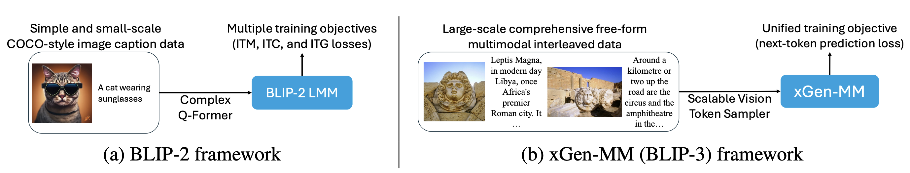

# xGen-MM (BLIP-3): A Family of Open Large Multimodal Models

[Techical report](https://arxiv.org/pdf/2408.08872) | [Project Page](https://www.salesforceairesearch.com/opensource/xGen-MM/index.html) | [🤗 Model Cards](https://huggingface.co/Salesforce/xgen-mm-phi3-mini-instruct-interleave-r-v1.5) | [🤗 Dataset Cards (coming soon)](https://huggingface.co/datasets/Salesforce/blip3-ocr-200m)


<p align = "center">

<em>We introduce xGen-MM (BLIP-3), a framework (b) for developing Large Multimodal Models (LMMs). Our framework improves upon BLIP-2 (a) by (1) increasing the richness, scale, and diversity of training data, (2) replacing the Q-Former layers with a more scalable vision token sampler, and (3) simplifying the training process via the unification of the training objectives to a single loss at every training stage. The resulting suite of LMMs can perform various visual language tasks and achieve competitive performance across benchmarks. </em>
</p>

# Introduction
`xGen-MM` is a series of the latest foundational Large Multimodal Models (LMMs) developed by Salesforce AI Research. This series advances upon the successful designs of the `BLIP` series, incorporating fundamental enhancements that ensure a more robust and superior foundation. These models have been trained at scale on high-quality image caption datasets and interleaved image-text data. 

In the v1.5 (08/2024) release, we present a series of xGen-MM models including:
- [🤗 xGen-MM-base](https://huggingface.co/Salesforce/xgen-mm-phi3-mini-base-r-v1.5): `xgen-mm-phi3-mini-base-r-v1.5`
- [🤗 xGen-MM-instruct-singleimg](https://huggingface.co/Salesforce/xgen-mm-phi3-mini-instruct-singleimg-r-v1.5): `xgen-mm-phi3-mini-instruct-singleimg-r-v1.5`
- [🤗 xGen-MM-instruct-interleave (our main instruct model)](https://huggingface.co/Salesforce/xgen-mm-phi3-mini-instruct-interleave-r-v1.5): `xgen-mm-phi3-mini-instruct-interleave-r-v1.5`
- [🤗 xGen-MM-instruct-dpo](https://huggingface.co/Salesforce/xgen-mm-phi3-mini-instruct-dpo-r-v1.5): `xgen-mm-phi3-mini-instruct-dpo-r-v1.5`

In addition to the models, our team also released a series of datasets for multi-modal pre-training, including:
- [🍃 MINT-1T: Scaling Open-Source Multimodal Data by 10x: A Multimodal Dataset with One Trillion Tokens](https://arxiv.org/abs/2406.11271)
- [🤗 BLIP3-OCR-200M (coming soon)](https://huggingface.co/datasets/Salesforce/blip3-ocr-200m): a dataset with dense OCR annotations.
- [🤗 BLIP3-GROUNDING-50M (coming soon)](https://huggingface.co/datasets/Salesforce/blip3-grounding-50m): a dataset for enhancing the ability to ground semantic concepts in images.
- BLIP3-KALE (stay tuned): a large-scale curated high-quality caption dataset. 

This codebase provides the fine-tuning code that's used for producing our instrcut models (including `xgen-mm-phi3-mini-instruct-singleimg-r-v1.5`, `xgen-mm-phi3-mini-instruct-interleave-r-v1.5`, and `xgen-mm-phi3-mini-instruct-dpo-r-v1.5`.) 

For more details, check out our [tech report](https://arxiv.org/pdf/2408.08872) and [project page](https://www.salesforceairesearch.com/opensource/xGen-MM/index.html).

# Table of Contents
- [Installation](#installation)
- [Usage](#usage)
  * [Released models](#released-models)
  * [Initialze the model](#ininitialze-the-model)
  * [Inference example](#inference-demo)
- [Training](#training)
  * [Data preparation](#data-preparation)
  * [Base model weight preparation](#base-model-weight-preparation)
  * [Launch script](#launch-script) 
- [Evaluation](#evaluation)
- [Team](#team)
- [Acknowledgments](#acknowledgments)
- [Citing](#citing)

# Installation
We implement xGen-MM in the [OpenFlamingo](https://github.com/mlfoundations/open_flamingo) codebase, so one needs to install our customized `open_flamingo` library with the following steps.
To install the package in an existing environment, run the following commands in the current directory.
```
pip install -e .
```

or to create a conda environment for running OpenFlamingo, run
```
conda env create -f environment.yml
```

To install training or eval dependencies, run one of the first two commands. To install everything, run the third command.
```
pip install open-flamingo[training]
pip install open-flamingo[all]
```

There are two `requirements.txt` files: 
- `requirements.txt` 
- `requirements-training.txt`

Depending on your use case, you can install any of these with `pip install -r <requirements-file.txt>`. The base file contains only the dependencies needed for running the model.


# Usage

## Released models

Please refer to our [🤗 Model Cards](https://huggingface.co/Salesforce/xgen-mm-phi3-mini-instruct-r-v1) for the details about the released models.


## Ininitialze the model
```
# Model config.
cfg = dict(
 model_family = 'xgenmm_v1',
 lm_path = 'microsoft/Phi-3-mini-4k-instruct',
 vision_encoder_path = 'google/siglip-so400m-patch14-384',
 vision_encoder_pretrained = 'google',
 num_vision_tokens = 128,
 image_aspect_ratio = 'anyres',
 anyres_patch_sampling = True,
 ckpt_pth = "/path/to/your/checkpoint",
)
cfg = OmegaConf.create(cfg)
additional_kwargs={
 "image_aspect_ratio": cfg.image_aspect_ratio,
 "anyres_patch_sampling": cfg.anyres_patch_sampling,
 "num_vision_tokens": cfg.num_vision_tokens,
}

# Create model.
model, image_processor, tokenizer = create_model_and_transforms(
 clip_vision_encoder_path=cfg.vision_encoder_path,
 clip_vision_encoder_pretrained=cfg.vision_encoder_pretrained,
 lang_model_path=cfg.lm_path,
 tokenizer_path=cfg.lm_path,
 model_family=cfg.model_family,
 **additional_kwargs)

```
## Inference notebook

Check out `inference.ipynb` for example inference code.

## Example outputs


# Training

## Data Preparation
You will need to prepare your SFT training recipe in a `data_config.yaml` file. In the config file, each entry is a dataset with the number of samples to be used in training. The number of samples can be larger or smaller than the actual dataset size (for over or downsampling a certain data source). The image filenames in each data JSON file can be relative paths, and in that case, we will do a mapping from the relative path to the full path in the training environment. The path mapping is defined in a "data_path" file (see `data_configs/example_data_paths.py` for example).

Please see `data_configs/example_data_config.yaml` for an example config file and its associated `data_configs/example_data_paths.py`. Note that for all data sources, we convert them to llava format in the JSON file, so each data entry will have the following entries with corresponding key values:
```
{
 "id": "000000033471",
 "image": "coco/train2017/000000033471.jpg",
 "conversations": [
 {
 "from": "human",
 "value": "<image>\nWhat are the colors of the bus in the image?"
 },
 {
 "from": "gpt",
 "value": "The bus in the image is white and red."
 },
 {
 "from": "human",
 "value": "What feature can be seen on the back of the bus?"
 },
 {
 "from": "gpt",
 "value": "The back of the bus features an advertisement."
 },
 ...
 ]
}
```

## Base model weight preparation

We provide a script for converting [Salesforce/xgen-mm-phi3-mini-base-r-v1.5](https://huggingface.co/Salesforce/xgen-mm-phi3-mini-base-r-v1.5) from Huggingface hub to a checkpoint that can be load in PyTorch. To do the weight conversion and save the converted weight at `${you_local_path/base_model_weight.pt}`, run:
```
python convert_hf_model.py --dest_fn ${you_local_path/base_model_weight.pt}
```

## Launch script
After finishing the data preparation, see the example training script `scripts/example_finetune_xgenmmv1-phi3_mini_4k_instruct.sh` for the command to launch fine-tuning with 8 GPUs.    

# Evaluation
Our evaluation is implemented based on [open-compass/VLMEvalKit](https://github.com/open-compass/VLMEvalKit). We will create a PR to that repo to support xGen-MM evaluation.


## Development

Your contribution is welcome! We use pre-commit hooks to align formatting with the checks in the repository. 
1. To install pre-commit, run
 ```
 pip install pre-commit
 ```
 or use brew for MacOS
 ```
 brew install pre-commit
 ```
2. Check the version installed with
 ```
 pre-commit --version
 ```
3. Then at the root of this repository, run
 ```
 pre-commit install
 ```
Then every time we run git commit, the checks are run. If the files are reformatted by the hooks, run `git add` for your changed files and `git commit` again


# Acknowledgments
Our training code is based on [OpenFlamingo: An open-source framework for training large multimodal models.](https://github.com/mlfoundations/open_flamingo), and part of our data preprocessing code is adapted from [LLaVA](https://github.com/haotian-liu/LLaVA).
Our evaluation code is based on [VLMEvalKit: Open-source evaluation toolkit of large vision-language models (LVLMs)](https://github.com/open-compass/VLMEvalKit).

We thank the authors for their open-source implementations.


## Citation
```
@article{blip3,
 author    = {Le Xue, Manli Shu, Anas Awadalla, Jun Wang, An Yan, Senthil Purushwalkam, Honglu Zhou, Viraj Prabhu, Yutong Dai, Michael S Ryoo, Shrikant Kendre, Jieyu Zhang, Can Qin, Shu Zhang, Chia-Chih Chen, Ning Yu, Juntao Tan, Tulika Manoj Awalgaonkar, Shelby Heinecke, Huan Wang, Yejin Choi, Ludwig Schmidt, Zeyuan Chen, Silvio Savarese, Juan Carlos Niebles, Caiming Xiong, Ran Xu},
 title     = {xGen-MM (formerly BLIP-3): A Family of Open Large Multimodal Models},
 journal   = {arXiv preprint},
 year      = {2024},
}
```

