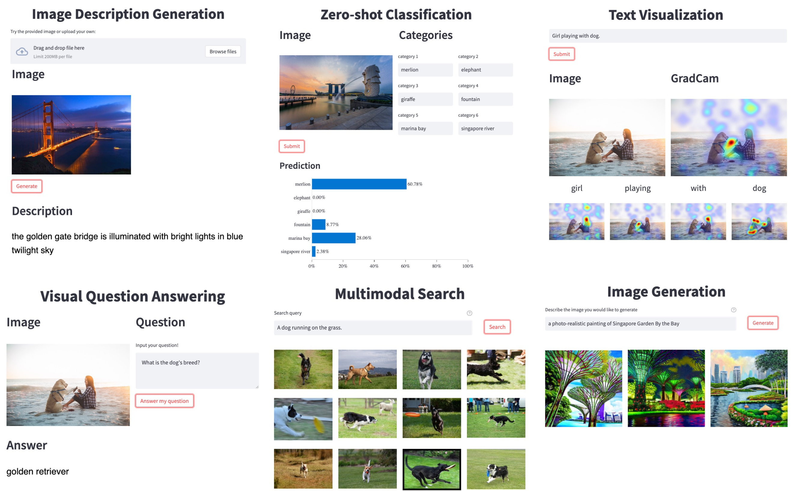

<p align="center">
    <br>
    
    <br>
<p>

# LAVIS - A Library for Language-Vision Intelligence

## Table of Contents
- [LAVIS - A Library for Language-Vision Intelligence](#lavis---a-library-for-language-vision-intelligence)
  - [Table of Contents](#table-of-contents)
  - [Introduction](#introduction)
  - [Installation](#installation)
  - [Getting Started](#getting-started)
    - [Model Zoo](#model-zoo)
    - [Image Captioning](#image-captioning)
    - [Visual question answering (VQA)](#visual-question-answering-vqa)
    - [Load Datasets](#load-datasets)
  - [Resources and Tools](#resources-and-tools)
  - [Documentations](#documentations)
  - [Technical Report and Citing LAVIS](#technical-report-and-citing-lavis)
  - [Contact Us](#contact-us)
  - [License](#license)

## Introduction
LAVIS is a Python deep learning library for LAnguage-and-VISion research and applications.
It features a unified design to access
- **10+** common tasks
(retrieval, captioning, visual question answering, multimodal classification etc.);
- **20+** datasets (COCO, Flickr, Nocaps, Conceptual
Commons, SBU, etc.);
- **30+** pretrained weights of state-of-the-art foundation language-vision models and their task-specific adaptations, including [ALBEF](https://arxiv.org/pdf/2107.07651.pdf),
[BLIP](https://arxiv.org/pdf/2201.12086.pdf), [ALPRO](https://arxiv.org/pdf/2112.09583.pdf), [CLIP](https://arxiv.org/pdf/2103.00020.pdf).
<p align="center">
    <br>
    
    <br>
<p>

This library aims to provide engineers and researchers with a one-stop solution to rapidly develop models for their specific multimodal
scenarios, and benchmark them across standard and customized datasets.

Key features of LAVIS include:

- **Unified and Modular Interface**: facilitating to easily leverage and repurpose existing modules (datasets, models, preprocessors), also to add new modules.

- **Easy Off-the-shelf Inference and Feature Extraction**: readily available pre-trained models let you take advantage of state-of-the-art multimodal understanding and generation capabilities on your own data.

- **Reproducible Model Zoo**: provided training/pre-training recipies to easily replicate and extend state-of-the-art models.

- **Dataset Zoo and Automatic Downloading Tools**: it can be a hassle to prepare the many language-vision datasets. LAVIS provides automatic downloaing scripts to help prepare a large variety of datasets and their annotations.


The following table shows the supported tasks, datasets and models in our library. This is a continuing effort and we are working on further growing the list.

|                  Tasks                   |     Supported Models     |             Supported Datasets             |
| :--------------------------------------: | :----------------------: | :----------------------------------------: |
|         Image-text Pre-training          |       ALBEF, BLIP        | COCO, VisualGenome, SBU ConceptualCaptions |
|           Image-text Retrieval           |    ALBEF, BLIP, CLIP     |              COCO, Flickr30k               |
|           Text-image Retrieval           |    ALBEF, BLIP, CLIP     |              COCO, Flickr30k               |
|        Visual Question Answering         |       ALBEF, BLIP        |           VQAv2, OKVQA, A-OKVQA            |
|             Image Captioning             |           BLIP           |                COCO, NoCaps                |
|           Image Classification           |           CLIP           |                  ImageNet                  |
| Natural Language Visual Reasoning (NLVR) |       ALBEF, BLIP        |                   NLVR2                    |
|          Visual Entailment (VE)          |          ALBEF           |                  SNLI-VE                   |
|             Visual Dialogue              |           BLIP           |                  VisDial                   |
|           Video-text Retrieval           |       BLIP, ALPRO        |               MSRVTT, DiDeMo               |
|           Text-video Retrieval           |       BLIP, ALPRO        |               MSRVTT, DiDeMo               |
|    Video Question Answering (VideoQA)    |       BLIP, ALPRO        |                MSRVTT, MSVD                |
|              Video Dialogue              |         VGD-GPT          |                    AVSD                    |
|      Multimodal Feature Extraction       | ALBEF, CLIP, BLIP, ALPRO |                 customized                 |

## Installation

1. (Optional) Creating conda environment

```bash
conda create -n lavis python=3.8
conda activate lavis
```

2. Cloning and building from source

```bash
git clone https://github.com/MetaMind/LAVIS.git
cd LAVIS
pip install .
```

If you would like to develop on LAVIS, it is recommended to install in editable mode:
```bash
pip install -e .
```

## Getting Started
### Model Zoo
Model zoo summarizes supported models in LAVIS, to view:
```python
from lavis.models import model_zoo
print(model_zoo)
# ==================================================
# Architectures                  Types
# ==================================================
# albef_classification           ve
# albef_feature_extractor        base
# albef_nlvr                     nlvr
# albef_pretrain                 base
# albef_retrieval                coco, flickr
# albef_vqa                      vqav2
# alpro_qa                       msrvtt, msvd
# alpro_retrieval                msrvtt, didemo
# blip_caption                   base_coco, large_coco
# blip_classification            base
# blip_feature_extractor         base
# blip_nlvr                      nlvr
# blip_pretrain                  base
# blip_retrieval                 coco, flickr
# blip_vqa                       vqav2, okvqa, aokvqa
# clip_feature_extractor         ViT-B-32, ViT-B-16, ViT-L-14, ViT-L-14-336, RN50
# clip                           ViT-B-32, ViT-B-16, ViT-L-14, ViT-L-14-336, RN50
# gpt_dialogue                   base
```

Let’s see how to use models in LAVIS to perform inference on example data. We first load a sample image from local.

```python
import torch
from PIL import Image
# setup device to use
device = torch.device("cuda" if torch.cuda.is_available() else "cpu")
# load sample image
raw_image = Image.open("docs/_static/merlion.png").convert("RGB")
```

This example image shows [Merlion park](https://en.wikipedia.org/wiki/Merlion) ([source](https://theculturetrip.com/asia/singapore/articles/what-exactly-is-singapores-merlion-anyway/)), a landmark in Singapore.


### Image Captioning
In this example, we use the BLIP model to generate a caption for the image. To make inference even easier, we also associate each
pre-trained model with its preprocessors (transforms), accessed via ``load_model_and_preprocess()``.

```python
import torch
from lavis.models import load_model_and_preprocess
device = torch.device("cuda" if torch.cuda.is_available() else "cpu")
# loads BLIP caption base model, with finetuned checkpoints on MSCOCO captioning dataset.
# this also loads the associated image processors
model, vis_processors, _ = load_model_and_preprocess(name="blip_caption", model_type="base_coco", is_eval=True, device=device)
# preprocess the image
# vis_processors stores image transforms for "train" and "eval" (validation / testing / inference)
image = vis_processors["eval"](raw_image).unsqueeze(0).to(device)
# generate caption
model.generate({"image": image})
# ['a large fountain spewing water into the air']
```

### Visual question answering (VQA)
BLIP model is able to answer free-form questions about images in natural language.
To access the VQA model, simply replace the ``name`` and ``model_type`` arguments
passed to ``load_model_and_preprocess()``.

```python
from lavis.models import load_model_and_preprocess
model, vis_processors, txt_processors = load_model_and_preprocess(name="blip_vqa", model_type="vqav2", is_eval=True, device=device)
# ask a random question.
question = "Which city is this photo taken?"
image = vis_processors["eval"](raw_image).unsqueeze(0).to(device)
question = txt_processors["eval"](question)
model.predict_answers(samples={"image": image, "text_input": question}, inference_method="generate")
# ['singapore']
```

Unified Feature Extraction Interface

LAVIS provides a unified interface to extract multimodal features from each architecture.
To extract features, we load the feature extractor variants of each model.

```python
from lavis.models import load_model_and_preprocess
model, vis_processors, txt_processors = load_model_and_preprocess(name="blip_feature_extractor", model_type="base", is_eval=True, device=device)
caption = "a large fountain spewing water into the air"
image = vis_processors["eval"](raw_image).unsqueeze(0).to(device)
text_input = txt_processors["eval"](question)
sample = {"image": image, "text_input": [text_input]}

features_multimodal = model.extract_features(sample)
print(features_multimodal.multimodal_embeds.shape)
# torch.Size([1, 9, 768])
features_image = model.extract_features(sample, mode="image")
print(features_image.image_embeds.shape)
# torch.Size([1, 197, 768])
features_text = model.extract_features(sample, mode="text")
print(features_text.text_embeds.shape)
# torch.Size([1, 9, 768])
```

### Load Datasets
LAVIS inherently supports a wide variety of common language-vision datasets by providing [automatic download tools](https://cuddly-giggle-94dc5918.pages.github.io/latest/benchmark) to help download and organize these datasets. After downloading, to load the datasets, use the following code:

```python
from lavis.datasets.builders import dataset_zoo
dataset_names = dataset_zoo.get_names()
print(dataset_names)
# ['aok_vqa', 'coco_caption', 'coco_retrieval', 'coco_vqa', 'conceptual_caption_12m',
#  'conceptual_caption_3m', 'didemo_retrieval', 'flickr30k', 'imagenet', 'laion2B_multi',
#  'msrvtt_caption', 'msrvtt_qa', 'msrvtt_retrieval', 'msvd_caption', 'msvd_qa', 'nlvr',
#  'nocaps', 'ok_vqa', 'sbu_caption', 'snli_ve', 'vatex_caption', 'vg_caption', 'vg_vqa']
```
After downloading the images, we can use ``load_dataset()`` to obtain the dataset.
```python
from lavis.datasets.builders import load_dataset
coco_dataset = load_dataset("coco_caption")
print(coco_dataset.keys())
# dict_keys(['train', 'val', 'test'])
print(len(coco_dataset["train"]))
# 566747
print(coco_dataset["train"][0])
# {'image': <PIL.Image.Image image mode=RGB size=640x480>,
#  'text_input': 'A woman wearing a net on her head cutting a cake. ',
#  'image_id': 0}
```

If you already host a local copy of the dataset, you can pass in the ``vis_path`` argument to change the default location to load images.

```python
coco_dataset = load_dataset("coco_caption", vis_path=YOUR_LOCAL_PATH)
```

## Resources and Tools
- **Benchmarks**: see [Benchmark](https://cuddly-giggle-94dc5918.pages.github.io/latest/benchmark) for instructions to evaluate and train supported models.
- **Dataset Download and Browsing**: see [Dataset Download](https://cuddly-giggle-94dc5918.pages.github.io/latest/benchmark) for instructions and automatic tools on download common language-vision datasets.
- **GUI Demo**: to run the demo locally, run ```bash run_scripts/run_demo.sh``` and then follow the instruction on the prompts to view in browser.


## Documentations
For more details and advanced usages, please refer to
[documentation](https://cuddly-giggle-94dc5918.pages.github.io/latest/index.html#).


## Technical Report and Citing LAVIS
You can find more details in our [technical report](assets/LAVIS_technical_report.pdf).

If you're using LAVIS in your research or applications, please cite using this BibTeX:
```
@article{lavis,
  author    = {Dongxu Li and Junnan Li and Hung Le and Guangsen Wang and Silvio Savarese and Steven Hoi},
  title     = {LAVIS: A Library for Language-Vision Intelligence},
  year      = {2022},
}
```

## Contact Us
If you have any questions, comments or suggestions, please do not hesitate to contact us at [TBD]()

## License
[BSD 3-Clause License](LICENSE)
