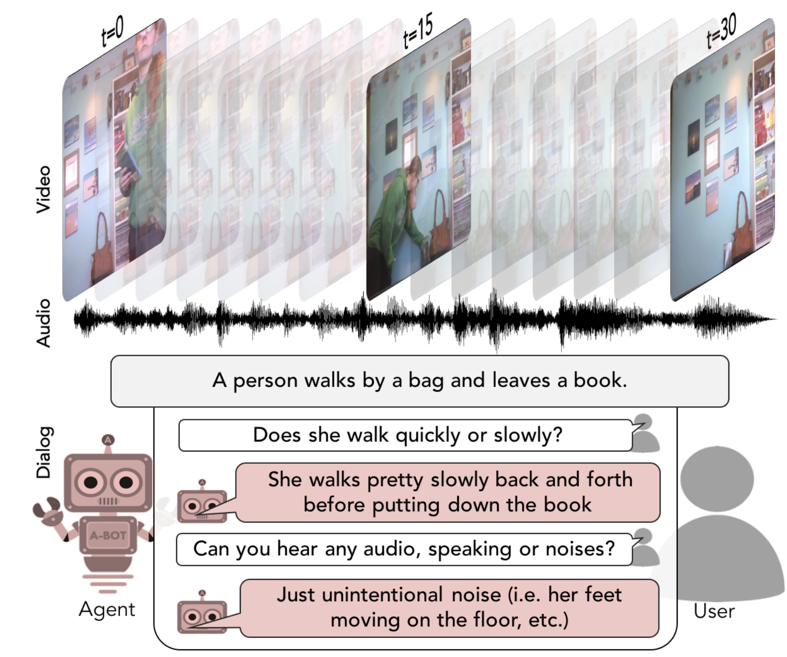

(Samples from the AVSD dataset. Image credit: "https://arxiv.org/pdf/1901.09107.pdf")

# Audio-Visual Scene-Aware Dialogues (AVSD) 

## Description
[Audio-Visual Scene-Aware Dialogues (AVSD)](https://github.com/hudaAlamri/DSTC7-Audio-Visual-Scene-Aware-Dialog-AVSD-Challenge) contains more than 10,000 dialogues, each of which is grounded on a unique video. In the test split, for each test sample, 6 reference dialogue responses are provided. 

## Task

(https://github.com/hudaAlamri/DSTC7-Audio-Visual-Scene-Aware-Dialog-AVSD-Challenge)

In a **video-grounded dialogue task**, the system must generate responses to a user input in the context of a given dialog.
This context consists of a dialog history (previous utterances by both user and system) in addition to video and audio information that comprise the scene. The quality of a system’s automatically generated sentences is evaluated using objective measures to determine whether or not the generated responses are natural and informative

## Metrics
Models are typically evaluated according to [BLEU](https://aclanthology.org/P02-1040/), [CIDER](https://www.cv-foundation.org/openaccess/content_cvpr_2015/papers/Vedantam_CIDEr_Consensus-Based_Image_2015_CVPR_paper.pdf), [METEOR](https://aclanthology.org/W05-0909/), and [ROUGE-L](https://aclanthology.org/W04-1013/) metrics. 

## Leaderboard

TBD

## Auto-Downloading

Please refer to [benchmark webite](https://github.com/hudaAlamri/DSTC7-Audio-Visual-Scene-Aware-Dialog-AVSD-Challenge) for instruction to download the dataset. 

## References
"Audio Visual Scene-Aware Dialog", Huda Alamri, Vincent Cartillier, Abhishek Das, Jue Wang, Anoop Cherian, Irfan Essa, Dhruv Batra, Tim K. Marks, Chiori Hori, Peter Anderson, Stefan Lee, Devi Parikh

