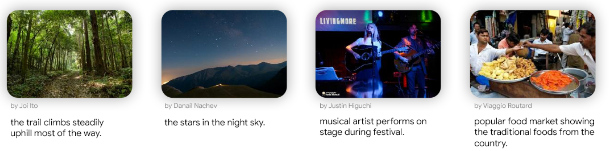

(image credit: https://ai.google.com/research/ConceptualCaptions/download)

# Conceptual Captions Dataset

## Description
(from https://huggingface.co/datasets/conceptual_captions)

Conceptual Captions 3M (CC3M) is a dataset consisting of ~3.3M images annotated with captions. In contrast with the curated style of other image caption annotations, Conceptual Caption images and their raw descriptions are harvested from the web, and therefore represent a wider variety of styles. More precisely, the raw descriptions are harvested from the Alt-text HTML attribute associated with web images. To arrive at the current version of the captions, we have developed an automatic pipeline that extracts, filters, and transforms candidate image/caption pairs, with the goal of achieving a balance of cleanliness, informativeness, fluency, and learnability of the resulting captions.

Conceptual Captions 12M (CC12M) is a dataset with 12 million image-text pairs specifically meant to be used for visionand-language pre-training. Its data collection pipeline is a relaxed version of the one used in Conceptual Captions 3M (CC3M).

## Task

Image-language pre-training; image captioning.

## Auto-Downloading
**Warning**: images of this dataset are downloadeded by requesting URLs. Since URLs may disappear with time, it is expected the downloaded dataset is partial.

### Conceptual Captions 3M
- Download images
```
cd lavis/datasets/download_scripts/DownloadConceptualCaptions && python download_data_cc3m.py
```
- Create annotations by running the notebook
```lavis/datasets/download_scripts/DownloadConceptualCaptions/create_annotation_3m.ipynb```

### Conceptual Captions 12M
- Download images
```
cd lavis/datasets/download_scripts/DownloadConceptualCaptions && python download_data_cc12m.py
```
- Create annotations by running the notebook
```lavis/datasets/download_scripts/DownloadConceptualCaptions/create_annotation_12m.ipynb```

## References
Edwin G. Ng, Bo Pang, Piyush Sharma and Radu Soricut. 2020. Understanding Guided Image Captioning Performance Across Domains. arXiv preprint arXiv:2012.02339.
