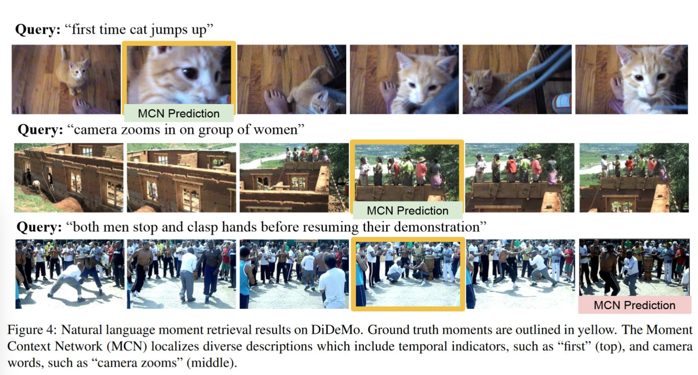

(Samples from the DiDeMo dataset. Image credit: "https://www.di.ens.fr/~miech/datasetviz/")

# DiDeMo Dataset (Retrieval)

## Description
[Microsoft COCO dataset](https://github.com/tylin/coco-caption) contains over one and a half million captions describing over 330,000 images. For the training and validation images, five independent human generated captions are be provided for each image.

## Task
Cross modal retrieval: (1) **image-text**: given an image as query, retrieve texts from a gallery; (2) **text-image**: given a text as query, retrieval images from a gallery.


## Metrics
Common metrics are recall@k, denotes the [recall score](https://en.wikipedia.org/wiki/Precision_and_recall) after k retrieval efforts.

We use TR to denote the image-text retrieval recall score and IR to denote text-image retrieval score.

## Leaderboard
(Ranked by TR@1.)
<!-- | Rank | Model  | TR@1  | TR@5  | TR@10 | IR@1  | IR@5  | IR@10 |                                                                                                                   Resources                                                                                                                    |
| ---- | :----: | :---: | :---: | :---: | :---: | :---: | :---: | :--------------------------------------------------------------------------------------------------------------------------------------------------------------------------------------------------------------------------------------------: |
| 1    |  BLIP  | 82.4  | 95.4  | 97.9  | 65.1  | 86.3  | 91.8  | [paper](https://arxiv.org/pdf/2201.12086.pdf), [code](https://github.com/salesforce/BLIP), [demo](https://huggingface.co/spaces/Salesforce/BLIP), [blog](https://blog.salesforceairesearch.com/blip-bootstrapping-language-image-pretraining/) |
| 2    | X-VLM  | 81.2  | 95.6  | 98.2  | 63.4  | 85.8  | 91.5  |                                                                          [paper](https://arxiv.org/pdf/2111.08276v3.pdf), [code](https://github.com/zengyan-97/X-VLM)                                                                          |
| 3    | ALBEF  | 77.6  | 94.3  | 97.2  | 60.7  | 84.3  | 90.5  |                                            [paper](https://arxiv.org/abs/2107.07651), [code](https://github.com/salesforce/ALBEF), [blog](https://blog.salesforceairesearch.com/align-before-fuse/)                                            |
| 3    | ALIGN  | 77.0  | 93.5  | 96.9  | 59.9  | 83.3  | 89.8  |                                                                                                   [paper](https://arxiv.org/abs/2102.05918)                                                                                                    |
| 4    | VinVL  | 75.4  | 92.9  | 96.2  | 58.8  | 83.5  | 90.3  |                                                                          [paper](https://arxiv.org/pdf/2101.00529v2.pdf), [code](https://github.com/microsoft/Oscar)                                                                           |
| 5    | OSCAR  | 73.5  | 92.2  | 96.0  | 57.5  | 82.8  | 89.8  |                                                                          [paper](https://arxiv.org/pdf/2004.06165v5.pdf), [code](https://github.com/microsoft/Oscar)                                                                           |
| 6    | UNITER | 65.7  | 88.6  | 93.8  | 52.9  | 79.9  | 88.0  |                                                          [paper](https://www.ecva.net/papers/eccv_2020/papers_ECCV/papers/123750103.pdf), [code](https://github.com/ChenRocks/UNITER)                                                          | -->

## Auto-Downloading

```
cd lavis/datasets/download_scripts && python download_didemo.py
```

## References
Anne Hendricks, Lisa, Oliver Wang, Eli Shechtman, Josef Sivic, Trevor Darrell, and Bryan Russell. "Localizing moments in video with natural language." In Proceedings of the IEEE international conference on computer vision, pp. 5803-5812. 2017.
