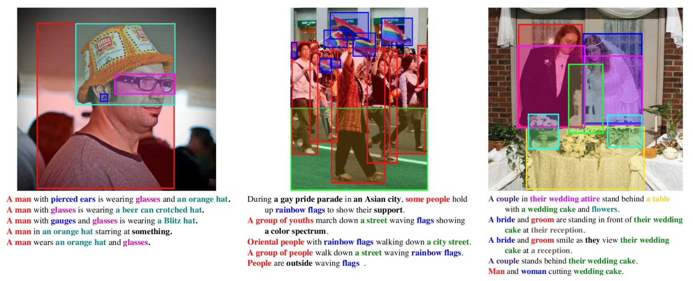

Samples from Flickr30k dataset (Image credit: "https://bryanplummer.com/Flickr30kEntities/")

# Flickr30K Dataset (Retrieval)

## Description
[Flickr30k](https://github.com/tylin/coco-caption) dataset contains 31k+ images collected from Flickr, together with 5 reference sentences provided by human annotators.

## Task
Cross modal retrieval: (1) **image-text**: given an image as query, retrieve texts from a gallery; (2) **text-image**: given a text as query, retrieval images from a gallery.


## Metrics
Common metrics are recall@k, denotes the [recall score](https://en.wikipedia.org/wiki/Precision_and_recall) after k retrieval efforts.

We use TR to denote the image-text retrieval recall score and IR to denote text-image retrieval score.

## Leaderboard
(Ranked by TR@1.)
| Rank | Model  | TR@1  | TR@5  | TR@10 | IR@1  | IR@5  | IR@10 |                                                                                                                   Resources                                                                                                                    |
| ---- | :----: | :---: | :---: | :---: | :---: | :---: | :---: | :--------------------------------------------------------------------------------------------------------------------------------------------------------------------------------------------------------------------------------------------: |
| 1    |  BLIP  | 97.2  | 99.9  | 100.0  | 87.5  | 97.7  | 98.9  | [paper](https://arxiv.org/pdf/2201.12086.pdf), [code](https://github.com/salesforce/BLIP), [demo](https://huggingface.co/spaces/Salesforce/BLIP), [blog](https://blog.salesforceairesearch.com/blip-bootstrapping-language-image-pretraining/) |
| 2    | X-VLM  | 97.1  | 100.0  | 100.0  | 86.9  | 97.3  | 98.7  |                                                                          [paper](https://arxiv.org/pdf/2111.08276v3.pdf), [code](https://github.com/zengyan-97/X-VLM)                                                                          |
| 3    | ALBEF  | 95.9  | 99.8  | 100.0  | 85.6  | 97.5  | 98.9  |                                            [paper](https://arxiv.org/abs/2107.07651), [code](https://github.com/salesforce/ALBEF), [blog](https://blog.salesforceairesearch.com/align-before-fuse/)                                            |
| 4    | ALIGN  | 95.3  | 99.8  | 100.0  | 84.9  | 97.4  | 98.6  |                                                                                                   [paper](https://arxiv.org/abs/2102.05918)                                                                                                    |                                                      |
| 5    | VILLA  | 87.9  | 97.5  | 98.8  | 76.3  | 94.2  | 96.8  |                                                                          [paper](https://arxiv.org/pdf/2004.06165v5.pdf), [code](https://github.com/microsoft/Oscar)                                                                           |
| 6    | UNITER | 87.3  | 98.0  | 99.2  | 75.6  | 94.1  | 96.8  |                                                          [paper](https://www.ecva.net/papers/eccv_2020/papers_ECCV/papers/123750103.pdf), [code](https://github.com/ChenRocks/UNITER)                                                          |

## Auto-Downloading
```
cd lavis/datasets/download_scripts && python download_flickr.py
```

## References
Bryan A. Plummer, Liwei Wang, Christopher M. Cervantes, Juan C. Caicedo, Julia Hockenmaier, and Svetlana Lazebnik, Flickr30K Entities: Collecting Region-to-Phrase Correspondences for Richer Image-to-Sentence Models, IJCV, 123(1):74-93, 2017. [paper]
