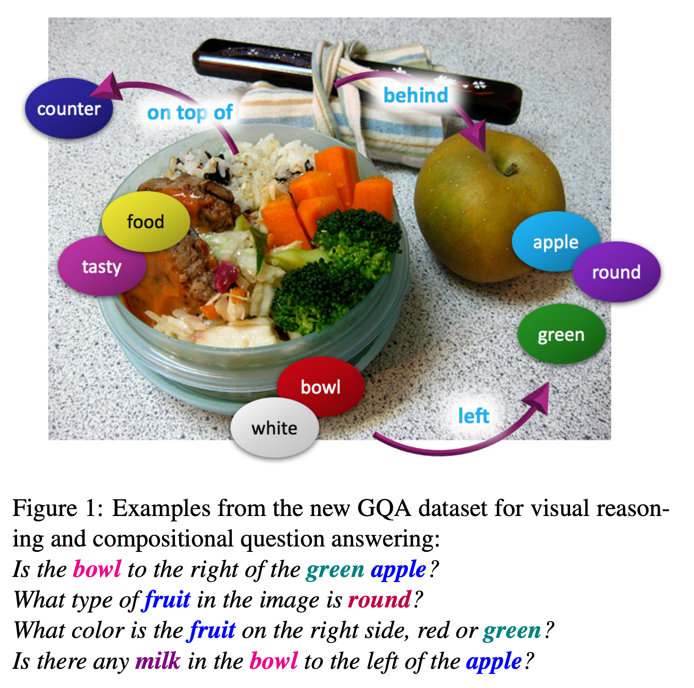

# GQA Dataset

## Description
(from https://cs.stanford.edu/people/dorarad/gqa/about.html)

GQA is a VQA dataset for real-word images which requires visual, spatial and compositional reasoning. 
It consists of 22M questions and 110K images.

## Task
(from https://arxiv.org/abs/1902.09506)

Given an image and a question, the model is required to output a correct answer. 
GQA questions require spatial understanding, multiple reasoning skills and multiple-step inference. 

## Metrics

The metrics are accuracy, consistency, validity, plausibility. The commonly reported metric is accuracy.

## Leaderboard

TBD

## Auto-Downloading

```
cd lavis/datasets/download_scripts && python download_gqa.py
```

## References
"GQA: A New Dataset for Real-World Visual Reasoning and Compositional Question Answering", Drew A. Hudson, Christopher D. Manning