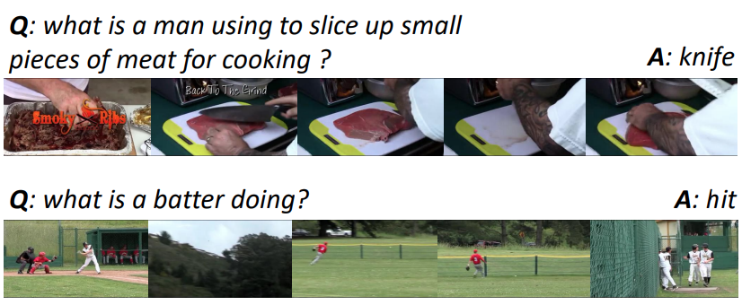

(Samples from MSRVTT-QA dataset, image credit: http://staff.ustc.edu.cn/~hexn/papers/mm17-videoQA.pdf)

# MSRVTT Dataset (Video Question Answering)

## Description
[MSRVTT](https://www.microsoft.com/en-us/research/publication/msr-vtt-a-large-video-description-dataset-for-bridging-video-and-language/) dataset is a large-scale video benchmark for video understanding, especially the emerging task of translating video to text. This is achieved by collecting 257 popular queries from a commercial video search engine, with 118 videos for each query. In its current version, MSR-VTT provides 10K web video clips with 41.2 hours and 200K clip-sentence pairs in total. Each clip is annotated with about 20 natural sentences by 1,327 AMT workers.

[MSRVTT-QA](http://staff.ustc.edu.cn/~hexn/papers/mm17-videoQA.pdf) dataset is based on the MSR-VTT dataset, which is larger and has more complex scenes. The dataset
contains 10K video clips and 243k question answer pairs.

## Task
Video question answering (VideoQA) is the task where
a video and a natural language question are provided and the model
needs to give the right answer (from [paper](http://staff.ustc.edu.cn/~hexn/papers/mm17-videoQA.pdf)).


## Metrics
Accuracy.

## Leaderboard
(Ranked by accurarcy on test-dev.)
| Rank | Model  | Acc. | Resources |
| ---- | :----: | :-------: | :-------: |
| 1    |  ALPro  |  42.1 |  [paper](https://arxiv.org/abs/2112.09583), [code](https://github.com/salesforce/ALPRO), [blog](https://blog.salesforceairesearch.com/alpro/) |
| 2   |  VQA-T  |  41.5 | [paper](https://openaccess.thecvf.com/content/ICCV2021/papers/Yang_Just_Ask_Learning_To_Answer_Questions_From_Millions_of_Narrated_ICCV_2021_paper.pdf), [code](https://github.com/antoyang/just-ask), [demo](http://videoqa.paris.inria.fr/) |
| 3   |  CoMVT | 39.5 | [paper](https://openaccess.thecvf.com/content/CVPR2021/papers/Seo_Look_Before_You_Speak_Visually_Contextualized_Utterances_CVPR_2021_paper.pdf) |
| 4   |  SSML | 35.1 | [paper](https://arxiv.org/abs/2003.03186) |
| 5   |  ClipBERT | 37.4 | [paper](https://arxiv.org/abs/2102.06183) [code](https://github.com/jayleicn/ClipBERT)|
| 6   |  HCRN | 35.6 | [paper](https://arxiv.org/abs/2002.10698) [code](https://github.com/thaolmk54/hcrn-videoqa) |
| 7   |  HGA | 35.5 | [paper](https://ojs.aaai.org/index.php/AAAI/article/view/6767) [code](https://github.com/Jumpin2/HGA) |
| 8   |  DualVGR | 35.5 | [paper](https://arxiv.org/pdf/2107.04768v1.pdf) [code](https://github.com/NJUPT-MCC/DualVGR-VideoQA) |
| 9   |  HME | 33.0 | [paper](https://arxiv.org/pdf/1904.04357.pdf), [code](https://github.com/fanchenyou/HME-VideoQA) |
| 10   |  AMU | 32.5 | [paper](http://staff.ustc.edu.cn/~hexn/papers/mm17-videoQA.pdf), [code](https://github.com/xudejing/video-question-answering) |


## Auto-Downloading
```
cd lavis/datasets/download_scripts && python download_msrvtt.py
```

## References
Xu, Jun, Tao Mei, Ting Yao, and Yong Rui. "Msr-vtt: A large video description dataset for bridging video and language." In Proceedings of the IEEE conference on computer vision and pattern recognition, pp. 5288-5296. 2016.

Xu, Dejing, Zhou Zhao, Jun Xiao, Fei Wu, Hanwang Zhang, Xiangnan He, and Yueting Zhuang. "Video question answering via gradually refined attention over appearance and motion." In Proceedings of the 25th ACM international conference on Multimedia, pp. 1645-1653. 2017.
