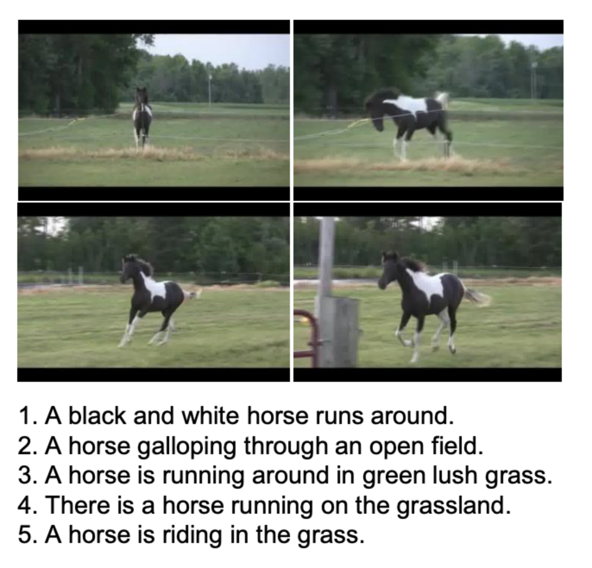

# MSRVTT Dataset (Retrieval)

## Description
[MSRVTT](https://www.microsoft.com/en-us/research/publication/msr-vtt-a-large-video-description-dataset-for-bridging-video-and-language/) dataset is a large-scale video benchmark for video understanding, especially the emerging task of translating video to text. This is achieved by collecting 257 popular queries from a commercial video search engine, with 118 videos for each query. In its current version, MSR-VTT provides 10K web video clips with 41.2 hours and 200K clip-sentence pairs in total. Each clip is annotated with about 20 natural sentences by 1,327 AMT workers.

## Task
Cross modal retrieval: (1) **video-text**: given a video as query, retrieve texts from a gallery; (2) **text-video**: given a text as query, retrieval videos from a gallery.

## Metrics
Common metrics are recall@k, denotes the [recall score](https://en.wikipedia.org/wiki/Precision_and_recall) after k retrieval efforts.

We use TR to denote the video-text retrieval recall score and VR to denote text-video retrieval score.

<!-- ## Leaderboard
(Ranked by TR@1.)
| Rank | Model  | TR@1  | TR@5  | TR@10 | IR@1  | IR@5  | IR@10 |                                                                                                                   Resources                                                                                                                    |
| ---- | :----: | :---: | :---: | :---: | :---: | :---: | :---: | :--------------------------------------------------------------------------------------------------------------------------------------------------------------------------------------------------------------------------------------------: |
| 1    |  BLIP  | 97.2  | 99.9  | 100.0  | 87.5  | 97.7  | 98.9  | [paper](https://arxiv.org/pdf/2201.12086.pdf), [code](https://github.com/salesforce/BLIP), [demo](https://huggingface.co/spaces/Salesforce/BLIP), [blog](https://blog.salesforceairesearch.com/blip-bootstrapping-language-image-pretraining/) |
| 2    | X-VLM  | 97.1  | 100.0  | 100.0  | 86.9  | 97.3  | 98.7  |                                                                          [paper](https://arxiv.org/pdf/2111.08276v3.pdf), [code](https://github.com/zengyan-97/X-VLM)                                                                          |
| 3    | ALBEF  | 95.9  | 99.8  | 100.0  | 85.6  | 97.5  | 98.9  |                                            [paper](https://arxiv.org/abs/2107.07651), [code](https://github.com/salesforce/ALBEF), [blog](https://blog.salesforceairesearch.com/align-before-fuse/)                                            |
| 4    | ALIGN  | 95.3  | 99.8  | 100.0  | 84.9  | 97.4  | 98.6  |                                                                                                   [paper](https://arxiv.org/abs/2102.05918)                                                                                                    |                                                      |
| 5    | VILLA  | 87.9  | 97.5  | 98.8  | 76.3  | 94.2  | 96.8  |                                                                          [paper](https://arxiv.org/pdf/2004.06165v5.pdf), [code](https://github.com/microsoft/Oscar)                                                                           |
| 6    | UNITER | 87.3  | 98.0  | 99.2  | 75.6  | 94.1  | 96.8  |                                                          [paper](https://www.ecva.net/papers/eccv_2020/papers_ECCV/papers/123750103.pdf), [code](https://github.com/ChenRocks/UNITER)                                                          | -->

## References
Xu, Jun, Tao Mei, Ting Yao, and Yong Rui. "Msr-vtt: A large video description dataset for bridging video and language." In Proceedings of the IEEE conference on computer vision and pattern recognition, pp. 5288-5296. 2016.
