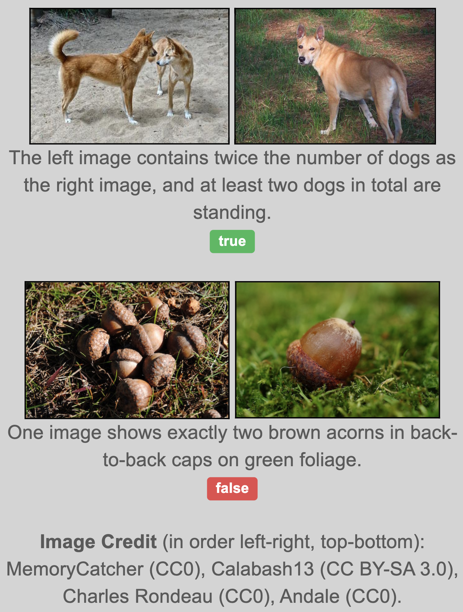

# Natural Language for Visual Reasoning for Real (NLVR2)

## Description
(from https://lil.nlp.cornell.edu/nlvr/)

NLVR2 contains 107,292 examples of human-written English sentences grounded in pairs of photographs. NLVR2 retains the linguistic diversity of NLVR, while including much more visually complex images.

We only publicly release the sentence annotations and original image URLs, and scripts that download the images from the URLs. If you would like direct access to the images, please fill out this Google Form. This form asks for your basic information and asks you to agree to our Terms of Service.

## Task
(from https://lil.nlp.cornell.edu/nlvr/)
The Natural Language for Visual Reasoning (NLVR) task is to determine whether a sentence is true about a visual input. The data was collected through crowdsourcings, and solving the task requires reasoning about sets of objects, comparisons, and spatial relations. This includes two corpora: NLVR, with synthetically generated images, and NLVR2, which includes natural photographs.

## Metrics
Accuracy.

## Leaderboard
(Ranked by accurarcy on dev.)
| Rank | Model  | dev | test | Resources |
| ---- | :----: | :------: | :------: | :-------: |
| 1    |  VLMo  |   88.6   |   89.5   |  [paper](https://arxiv.org/pdf/2111.02358.pdf) |
| 2    |  CoCa  |   86.1   |   87.0   |  [paper](https://arxiv.org/pdf/2205.01917.pdf) |
| 3    | SimVLM  |   84.5   |   85.2   | [paper](https://openreview.net/pdf?id=GUrhfTuf_3) |
| 4    | X-VLM  | 84.4  | 84.8  |  [paper](https://arxiv.org/pdf/2111.08276v3.pdf), [code](https://github.com/zengyan-97/X-VLM)
| 5    | VinVL  | 82.7 | 84.0 |                                                                          [paper](https://arxiv.org/pdf/2101.00529.pdf), [code](https://github.com/pzzhang/VinVL)                                                                           |
| 6    | ALBEF  |   82.6   |   83.1   |  [paper](https://arxiv.org/abs/2107.07651), [code](https://github.com/salesforce/ALBEF), [blog](https://blog.salesforceairesearch.com/align-before-fuse/)                                                 |
| 7    | BLIP  |   82.2   |   82.2   | [paper](https://arxiv.org/pdf/2201.12086.pdf), [code](https://github.com/salesforce/BLIP), [demo](https://huggingface.co/spaces/Salesforce/BLIP), [blog](https://blog.salesforceairesearch.com/blip-bootstrapping-language-image-pretraining/)|
| 8    |  OSCAR  |  78.1  | 78.4 |                           [paper](https://arxiv.org/pdf/2004.06165v5.pdf), [code](https://github.com/microsoft/Oscar)                            |
| 9    | SOHO  |   76.4   |   77.3  | [paper](https://arxiv.org/pdf/2104.03135.pdf), [code](https://github.com/researchmm/soho) |
| 10    | UNITER | 77.2  | 77.9 |                                                          [paper](https://www.ecva.net/papers/eccv_2020/papers_ECCV/papers/123750103.pdf), [code](https://github.com/ChenRocks/UNITER)                                                          |

## Downloading
Auto-downloading is not supported for this dataset. Please refer to https://lil.nlp.cornell.edu/nlvr/ and fill in the Google form to download the original images.

## References
Suhr, Alane, Stephanie Zhou, Ally Zhang, Iris Zhang, Huajun Bai, and Yoav Artzi. "A corpus for reasoning about natural language grounded in photographs." arXiv preprint arXiv:1811.00491 (2018).
