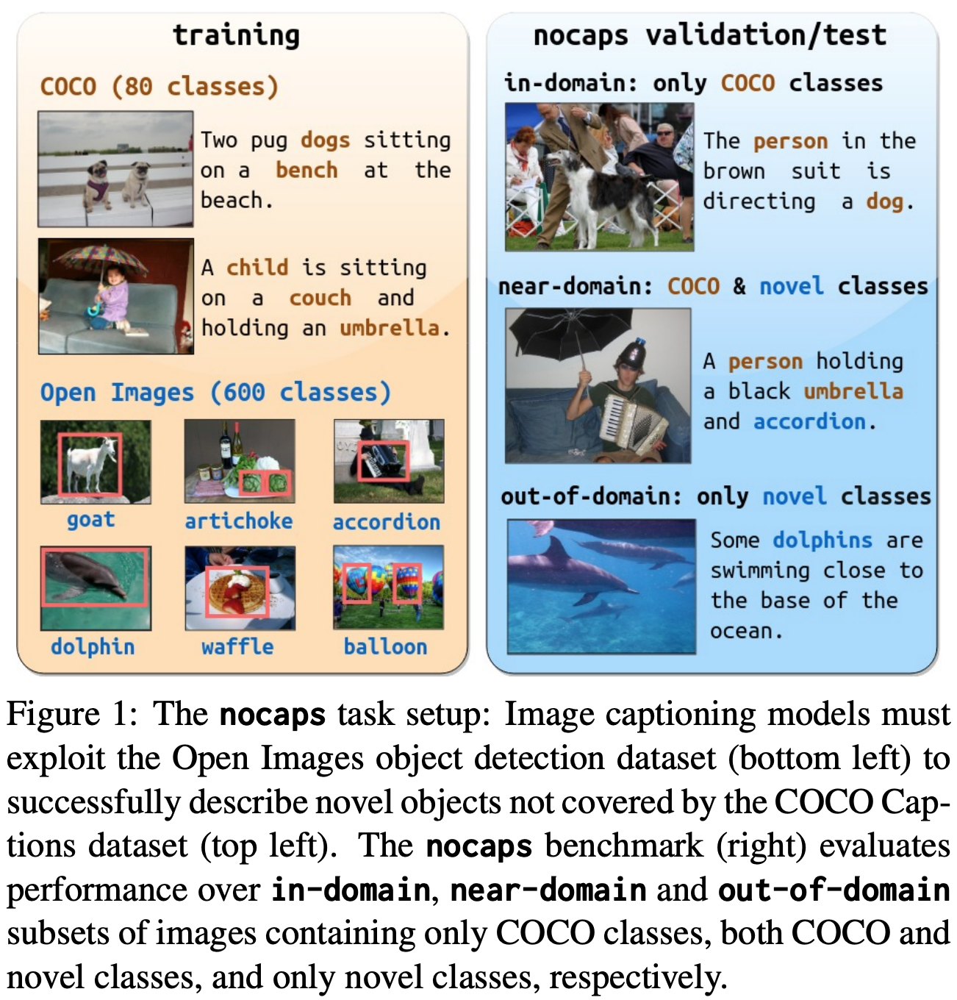

# Nocaps

## Description

our benchmark consists of 166,100 human-generated captions describing 15,100 images from the Open Images validation and test sets. The associated training data consists of COCO image-caption pairs, plus Open Images image-level labels and object bounding boxes. Since Open Images contains many more classes than COCO, nearly 400 object classes seen in test images have no or very few associated training captions (hence, nocaps).


## Task: Novel object captioning

(from https://nocaps.org/)

Image captioning models have achieved impressive results on datasets containing limited visual concepts and large amounts of paired image-caption training data. However, if these models are to ever function in the wild, a much larger variety of visual concepts must be learned, ideally from less supervision. To encourage the development of image captioning models that can learn visual concepts from alternative data sources, such as object detection datasets, we present the first large-scale benchmark for this task. Dubbed nocaps, for novel object captioning at scale


## Metrics
Models are typically evaluated according to a [CIDEr](https://aclanthology.org/P02-1040/) or [SPICE](https://www.cv-foundation.org/openaccess/content_cvpr_2015/papers/Vedantam_CIDEr_Consensus-Based_Image_2015_CVPR_paper.pdf) metric.

## Leaderboard

(Ranked by CIDEr)

| Rank |  Model  | val. CIDEr | val. SPICE |          test CIDEr | test SPICE |                                                          Resources                                                                     |
| ---- | :-----: | :----: | :---: | :----------------------------------------------------------------------------------------------------------------------------------------------: | :---:|:---:|
| 1    |  CoCa  |   122.4   |  15.5  | 120.6 | 15.5| [paper](https://arxiv.org/pdf/2205.01917.pdf) |
| 2    |  LEMON  |  117.3 | 15.0  |114.3 | 14.9           |                                                         [paper]()                                                                     |
| 3    |  BLIP   |  113.2 | 14.8 |  -  | -  | [paper](https://arxiv.org/pdf/2201.12086.pdf), [code](https://github.com/salesforce/BLIP), [demo](https://huggingface.co/spaces/Salesforce/BLIP) |
| 4    | SimVLM  |  112.2  | - | 110.3  | 14.5  |                                                [paper](https://openreview.net/pdf?id=GUrhfTuf_3)                                                 |
| 5    |  VinVL  |  105.1  | 14.4 |  103.7  | 14.4  |                           [paper](https://arxiv.org/pdf/2101.00529v2.pdf), [code](https://github.com/microsoft/Oscar)                            |

## Auto-Downloading
```
cd lavis/datasets/download_scripts && python download_nocaps.py
```

## References
Agrawal, Harsh, Karan Desai, Yufei Wang, Xinlei Chen, Rishabh Jain, Mark Johnson, Dhruv Batra, Devi Parikh, Stefan Lee, and Peter Anderson. "Nocaps: Novel object captioning at scale." In Proceedings of the IEEE/CVF International Conference on Computer Vision, pp. 8948-8957. 2019.
