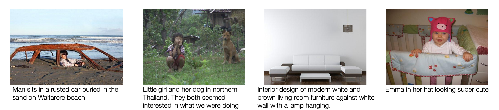

(image credit: http://tamaraberg.com/papers/generation_nips2011.pdf)

# SBU Caption Dataset
(from http://tamaraberg.com/papers/generation_nips2011.pdf)

SBU caption dataset is a new dataset, collected by performing Flickr queries and
then filtering the noisy results down to 1 million images with associated visually
relevant captions.

## Auto-Downloading
```
cd lavis/datasets/download_scripts && python download_sbu.py
```
## References
```bibtex
@inproceedings{Ordonez:2011:im2text,
  Author    = {Vicente Ordonez and Girish Kulkarni and Tamara L. Berg},
  Title     = {Im2Text: Describing Images Using 1 Million Captioned Photographs},
  Booktitle = {Neural Information Processing Systems ({NIPS})},
  Year      = {2011},
}
```
