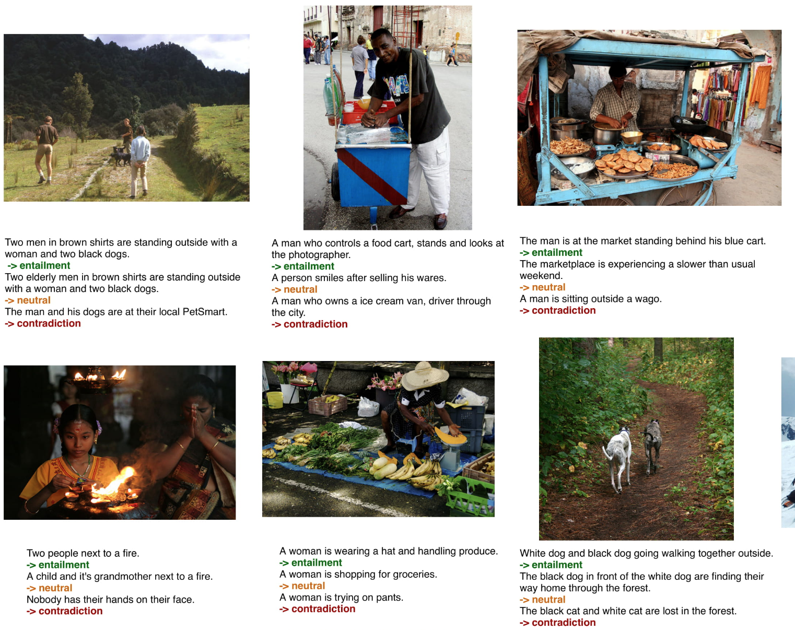

# SNLI-VE: Visual Entailment Dataset

## Description
(from https://arxiv.org/abs/1811.10582)

**The SNLI_VE dataset is built on top of Flickr30k. See downloading scripts below.**

Distribution by Split
The data details of train, dev and test split is shown below. The instances of three labels (entailment, neutral and contradiction) are evenly distributed for each split.

|Train|	Dev	|Test|
| ---- | :----: | :------: |
|#Image | 29783 | 1000 |	1000
|#Entailment | 176932 | 5959 | 	5973
|#Neutral| 176045 | 5960 | 	5964
|#Contradiction |	176550| 5939|	5964
|Vocabulary | Size|	29550| 6576|	6592

## Task
(from https://github.com/necla-ml/SNLI-VE)

The problem that Visual Entailment (VE) is trying to solve is to reason about the relationship between an image premise Pimage and a text hypothesis Htext.

Specifically, given an image as premise, and a natural language sentence as hypothesis, three labels (entailment, neutral and contradiction) are assigned based on the relationship conveyed by the (P_{image}, H_{text})

entailment holds if there is enough evidence in P_{image} to conclude that H_{text} is true.
contradiction holds if there is enough evidence in P_{image} to conclude that H_{text} is false.
Otherwise, the relationship is neutral, implying the evidence in P_{image} is insufficient to draw a conclusion about H_{text}.


## Metrics
Accuracy.

## Leaderboard
(Ranked by accurarcy on dev.)
| Rank | Model  | dev | test | Resources |
| ---- | :----: | :------: | :------: | :-------: |
| 1    |  CoCa  |   87.0   |   87.1   |  [paper](https://arxiv.org/pdf/2205.01917.pdf) |
| 2    | SimVLM  |   86.2   |   86.3   | [paper](https://openreview.net/pdf?id=GUrhfTuf_3) |
| 3    | SOHO  |   85.0   |  85.0  | [paper](https://arxiv.org/pdf/2104.03135.pdf), [code](https://github.com/researchmm/soho) |
| 4    | ALBEF  |   80.8   |   80.9   |  [paper](https://arxiv.org/abs/2107.07651), [code](https://github.com/salesforce/ALBEF), [blog](https://blog.salesforceairesearch.com/align-before-fuse/)                                                 |
| 5    | VILLA  | 80.2  | 80.0  |                                                                          [paper](https://arxiv.org/pdf/2004.06165v5.pdf), [code](https://github.com/microsoft/Oscar)                                                                           |
| 6    | UNITER | 79.4  | 79.4 |                                                          [paper](https://www.ecva.net/papers/eccv_2020/papers_ECCV/papers/123750103.pdf), [code](https://github.com/ChenRocks/UNITER)                                                          |
| 7    | LXMERT | 72.4  | 72.5 |                                                          [paper](https://aclanthology.org/D19-1514.pdf), [code](https://github.com/airsplay/lxmert)                                                          |
| 8    |  BUTD   |  65.3  | 65.7 |   [paper](https://arxiv.org/abs/1707.07998?context=cs), [code](https://github.com/peteanderson80/bottom-up-attention)                |

## Auto-Downloading
```
cd lavis/datasets/download_scripts && python download_flickr.py
```

## References
Xie, Ning, Farley Lai, Derek Doran, and Asim Kadav. "Visual entailment task for visually-grounded language learning." arXiv preprint arXiv:1811.10582 (2018).
