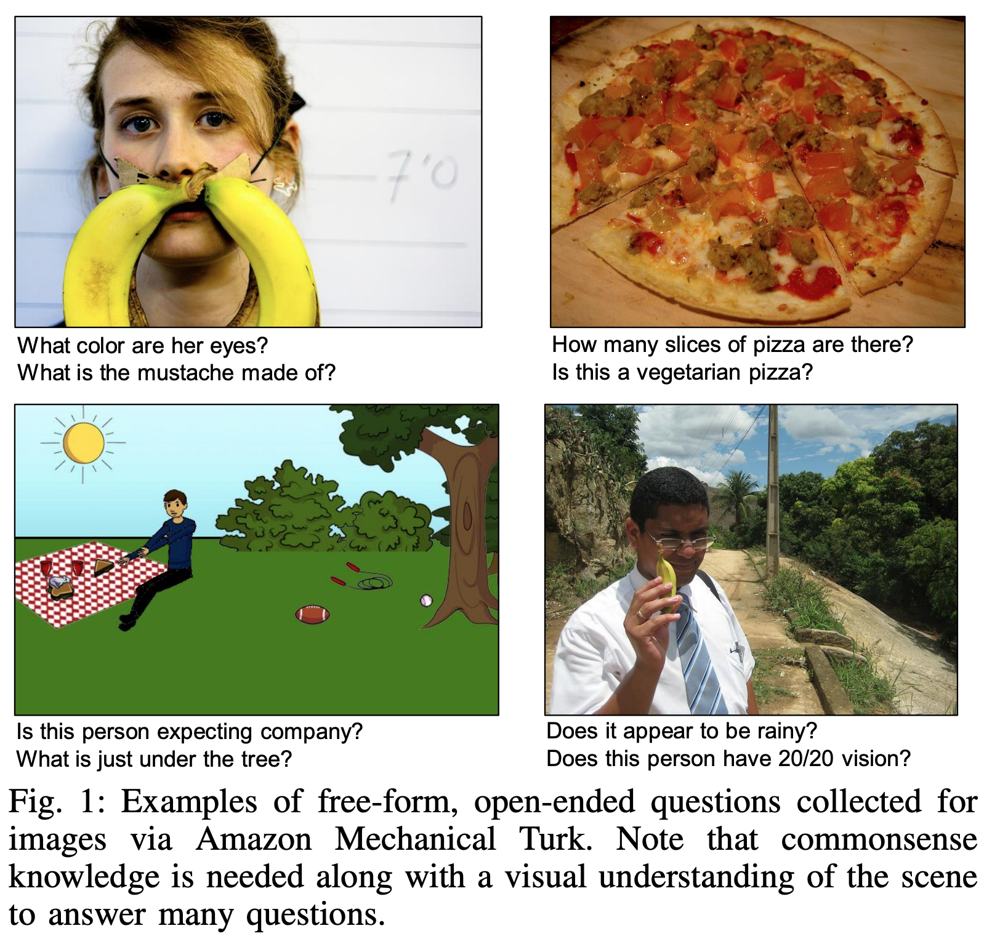

# Microsoft COCO Dataset (VQAv2)

## Description
(from https://visualqa.org/index.html)

Visual Question Answering (VQA) v2.0 is a dataset containing open-ended questions about images. These questions require an understanding of vision, language and commonsense knowledge to answer. It is the second version of the VQA dataset.

- 265,016 images (COCO and abstract scenes)
- At least 3 questions (5.4 questions on average) per image
- 10 ground truth answers per question
- 3 plausible (but likely incorrect) answers per question
- Automatic evaluation metric

## Task
(from https://arxiv.org/pdf/1505.00468.pdf)

The task of free-form and open-ended Visual Question Answering (VQA): given an image and a natural
language question about the image, the task is to provide an accurate natural language answer. Mirroring real-world scenarios, such
as helping the visually impaired, both the questions and answers are open-ended..

## Metrics
Accuracies computed by evaluation server: https://eval.ai/web/challenges/challenge-page/830/leaderboard/2278

## Leaderboard
(Ranked by accurarcy on test-dev.)
| Rank | Model  | test-dev | test-std | Resources |
| ---- | :----: | :------: | :------: | :-------: |
| 1    |  VLMo  |   82.8   |   82.8   |  [paper](https://arxiv.org/pdf/2205.01917.pdf) |
| 2    |  CoCa  |   82.3   |   82.3   |  [paper](https://arxiv.org/pdf/2205.01917.pdf) |
| 3    |  OFA  |   82.0   |   82.0   |   [paper](https://arxiv.org/abs/2202.03052), [code](https://github.com/OFA-Sys/OFA)  |
| 4    |  Florence  |   80.2   |   80.4   |   [paper](https://arxiv.org/abs/2111.11432), [code](https://github.com/OFA-Sys/OFA)  |
| 5    | SimVLM  |   80.0   |   80.3   | [paper](https://openreview.net/pdf?id=GUrhfTuf_3)                                                                                                                  |
| 6    | BLIP  |   78.3   |   78.3   | [paper](https://arxiv.org/pdf/2201.12086.pdf), [code](https://github.com/salesforce/BLIP), [demo](https://huggingface.co/spaces/Salesforce/BLIP) |
| 7    | X-VLM  | 78.2  | 78.4  |  [paper](https://arxiv.org/pdf/2111.08276v3.pdf), [code](https://github.com/zengyan-97/X-VLM)                                                                          |
| 8    | VinVL  |   76.6   |   76.6  | [paper](https://arxiv.org/pdf/2101.00529v2.pdf), [code](https://github.com/microsoft/Oscar) |
| 9    | ALBEF  |   75.8   |   76.0   |  [paper](https://arxiv.org/abs/2107.07651), [code](https://github.com/salesforce/ALBEF), [blog](https://blog.salesforceairesearch.com/align-before-fuse/)                                                                                       |
| 10    | UNITER | 73.8  | 74.0 |                                                          [paper](https://www.ecva.net/papers/eccv_2020/papers_ECCV/papers/123750103.pdf), [code](https://github.com/ChenRocks/UNITER)                                                          |

## Auto-Downloading

```
cd lavis/datasets/download_scripts && python download_coco.py
```

## References
"Microsoft COCO Captions: Data Collection and Evaluation Server", Xinlei Chen, Hao Fang, Tsung-Yi Lin, Ramakrishna Vedantam, Saurabh Gupta, Piotr Dollar, C. Lawrence Zitnick

"Vqa: Visual question answering." Antol, Stanislaw, Aishwarya Agrawal, Jiasen Lu, Margaret Mitchell, Dhruv Batra, C. Lawrence Zitnick, and Devi Parikh.
