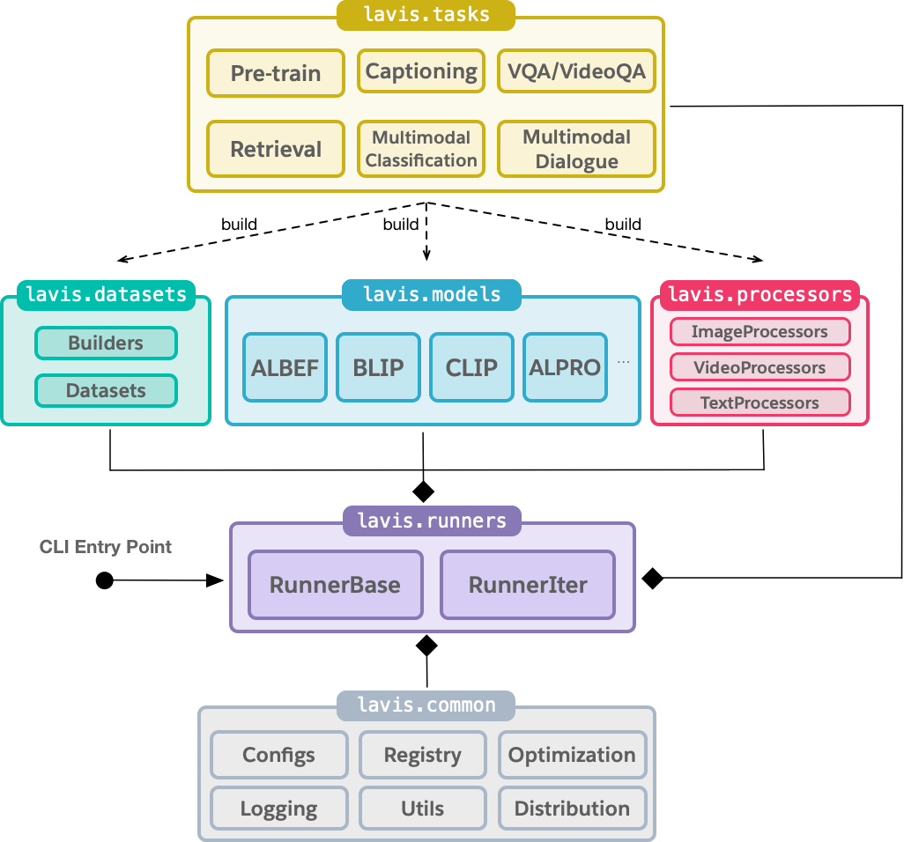

What is LAVIS?
####################################

LAVIS is a Python deep learning library for LAnguage-and-VISion research and applications.
It features a unified design to access state-of-the-art foundation language-vision models (`ALBEF <https://arxiv.org/pdf/2107.07651.pdf>`_,
`BLIP <https://arxiv.org/pdf/2201.12086.pdf>`_, `ALPRO <https://arxiv.org/pdf/2112.09583.pdf>`_, `CLIP <https://arxiv.org/pdf/2103.00020.pdf>`_), common tasks 
(retrieval, captioning, visual question answering, multimodal classification etc.) and datasets (COCO, Flickr, Nocaps, Conceptual
Commons, SBU, etc.).

This library aims to provide engineers and researchers with a one-stop solution to rapidly develop models for their specific multimodal
scenarios, and benchmark them across standard and customized datasets. 

Key features of LAVIS include:

- **Modular and Extensible Library Design**: facilitating to easily utilize and repurpose existing modules (datasets, models, preprocessors), also to add new modules.

- **Easy Off-the-shelf Inference and Feature Extraction**: readily available pre-trained models let you take advantage of state-of-the-art multimodal understanding and generation capabilities on your own data.

- **Reproducible Model Zoo**: provided training/pre-training recipies to easily replicate and extend state-of-the-art models.

- **Dataset Zoo and Automatic Downloading Tools**: it can be a hassle to prepare the many language-vision datasets. LAVIS provides automatic downloaing scripts to help prepare a large variety of datasets and their annotations.

Other features include:

- **Distributed Training** using multiple GPUs on one machine or across multiple machines.

- **Web Demo**: try supported models on your own pictures, questions etc.

- **Leaderboard**: comparing state-of-the-art models across standard datasets. 

- **Dataset Explorer**: help browse and understand language-vision datasets.

Supported Tasks, Models and Datasets
####################################

The following table shows the supported models and language-vision tasks by LAVIS. Adapting existing models to more tasks is possible and next to come in future releases.

======================================== =========================== ============================================= ============ 
Tasks                                     Supported Models            Supported Datasets                            Modalities  
======================================== =========================== ============================================= ============ 
Image-text Pre-training                   ALBEF, BLIP                 COCO, VisualGenome, SBU, ConceptualCaptions  image, text  
Image-text Retrieval                      ALBEF, BLIP, CLIP           COCO, Flickr30k                              image, text  
Text-image Retrieval                      ALBEF, BLIP, CLIP           COCO, Flickr30k                              image, text  
Visual Question Answering                 ALBEF, BLIP                 VQAv2, OKVQA, A-OKVQA                        image, text  
Image Captioning                          BLIP                        COCO, NoCaps                                 image, text  
Image Classification                      CLIP                        ImageNet                                     image        
Natural Language Visual Reasoning (NLVR)  ALBEF, BLIP                 NLVR2                                        image, text  
Visual Entailment (VE)                    ALBEF                       SNLI-VE                                      image, text  
Visual Dialogue                           BLIP                        VisDial                                      image, text  
Video-text Retrieval                      BLIP, ALPRO                 MSRVTT, DiDeMo                               video, text  
Text-video Retrieval                      BLIP, ALPRO                 MSRVTT, DiDeMo                               video, text  
Video Question Answering (VideoQA)        BLIP, ALPRO                 MSRVTT, MSVD                                 video, text  
Video Dialogue                            VGD-GPT                     AVSD                                         video, text  
Multimodal Feature Extraction             ALBEF, CLIP, BLIP, ALPRO    customized                                   image, text  
======================================== =========================== ============================================= ============ 

Library Design
####################################

LAVIS has six key modules.

- ``lavis.runners`` manages the overall training and evaluation lifecycle. It is also responsible for creating required components lazily as per demand, such as optimizers, learning rate schedulers and dataloaders. Currently ``RunnerBase`` implements epoch-based training and ``RunerIters`` implements iteration-based training.
- ``lavis.tasks`` implements concrete training and evaluation logic per task. A task could be, for example, retrieval, captioning, pre-training. The rationale to have an abstraction of task is to accommodate task-specific training and evaluation. For example, evaluating a retrieval model is different from a classification model.
- ``lavis.datasets`` is responsible for creating datasets, where ``lavis.datasets.builders`` loads dataset configurations, downloads annotations and returns a dataset object; ``lavis.datasets.datasets`` defines the supported datasets, each is a ``torch.utils.data.Dataset`` instance. We also provide `automatic dataset downloading tools` in ``datasets/download_scripts`` to help prepare common public datasets.
- ``lavis.models`` holds definition for the supported models and shared model layers.
- ``lavis.processors`` handles preprocessing of text and images/videos before feeding the model. For images and videos, a processor can be thought as transfroms in torchvision; for text input, this may include lowering case, truncation etc.
- ``lavis.common`` module contains shared classes and methods used by multiple other modules. For example,

   - ``lavis.common.config`` contains classes to store and manipulate configuration files used by LAVIS. In particular, we use a hierarchical configuration design, to allow highly customizable training and evaluation.
   - ``lavis.common.registry``  serves as a centralized place to manage modules that share the same functionalities. It allows building datasets, models, tasks, and learning rate schedulers during runtime, by specifying their names as string in the configuration file.
   - ``lavis.common.optims`` contains definitions of learning rate schedulers.
   - ``lavis.common.dist_utils`` contains utilities for distributed training and evaluation.
   - ``lavis.common.utils`` contains miscellaneous utilities, mostly IO-related helper functions.

Installation
############
1. (Optional) Creating conda environment

.. code-block:: bash

   conda create -n lavis python=3.8
   conda activate lavis

2. Cloning and building from source

.. code-block:: bash

   git clone https://github.com/salesforce/LAVIS.git
   cd LAVIS
   pip install .

If you would like to develop on LAVIS, you may find it easier to build with editable mode::

   pip install -e .

