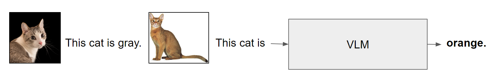
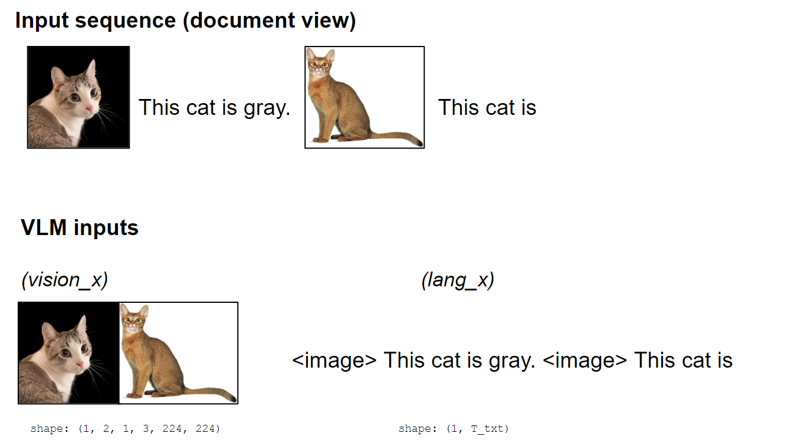
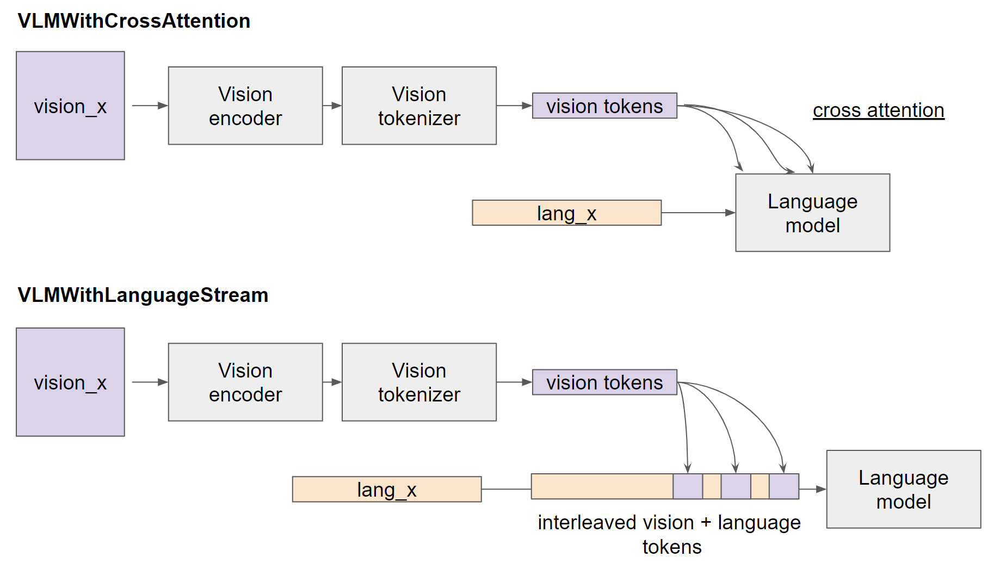

# OpenFlamingo: Modeling
We provide modules to mix-and-match into several vision-language model architectures.

## What is a VLM?
A **vision-language model (VLM)** is a language model capable of processing a sequence of arbitraily interleaved images/videos with text to output text. 

The forward signature of a VLM is as follows:

* `vision_x`: The batch of images / videos to process. This is a tensor of the shape `(B, T_img, F, C, H, W)`, where `B` is the batch dimension, `T_img` collates the images/videos within one input sequence, `F` collates frames within a video, and `(C, H, W)` are the channel, height, and width dimensions respectively.
* `lang_x`: The batch of input_ids (text) to process. This is a tensor of the shape `(B, T_txt)`, where `T_txt` is the number of text tokens within one input sequence. 

To explain to the model how to interleave the image/text elements within a sequence, `lang_x` should include `<image>` tokens ("media tokens") that specify where the images/videos are placed. (See figure below)

## VLM modeling with the open_flamingo repository
This repository provides modules for constructing various VLM architectures.

All models inherit from the `VLM` (vision-language model) class defined in `src/vlm.py`. As documented there, a VLM is defined by four component modules:
1. A **vision encoder** that extracts features from pixels (e.g. CLIP). This module should take in vision inputs of the shape `(B, T_img, F, C, H, W)` and output features of the shape `(B, T_img, F, v, d)`.
2. A **vision tokenizer** that converts features from the vision encoder into token-like embeddings (e.g. PerceiverResampler). This module should take in vision features of the shape `(B, T_img, F, v, d)` and output tokens of the shape `(B, T_img, n, d)`.
3. A fusion method that allows the language model to attend to these tokens, e.g. cross-attention (as done in [Flamingo](https://arxiv.org/abs/2204.14198)), or placing the tokens directly in the language model's input sequence (as done in [Kosmos](https://arxiv.org/abs/2306.14824)).
4. A language model.

This repository allows us to construct architectures by mixing-and-matching options for all four kinds of modules. 

### Supported vision encoders
All CLIP-style encoders from the [OpenCLIP](https://github.com/mlfoundations/open_clip) library are supported. This includes OpenAI's models.

### Supported vision tokenizers
* [Perceiver Resampler](https://arxiv.org/abs/2103.03206)
* [Q-former](https://arxiv.org/abs/2301.12597)
* Linear projection

### Supported fusion methods
Models are further split into those that inherit from `VLMWithCrossAttention` (dense cross attention to fuse vision + language, Flamingo-style) vs. `VLMWithLanguageStream` (insert vision tokens into the language stream, Kosmos-style).

### Supported language models
All autoregressive language models from [Huggingface Transformers](https://huggingface.co/models) are supported.

## Example architectures
Using these modules, the following architectures are implemented as examples.

|Model|Vision tokenizer|Fusion method|Trainable parameters|
|----|------------|------------|------------|
|[Flamingo](https://arxiv.org/abs/2204.14198)|Perceiver|Cross attention|Added language model embeddings, vision tokenizer|
|[Kosmos](https://arxiv.org/abs/2306.14824)|Perceiver|Language stream|Everything except the vision encoder|
|[BLIP](https://arxiv.org/abs/2301.12597)|Q-former|Language stream|Added language model embeddings, vision tokenizer|

We welcome contributions! If you'd like to add additional vision tokenizers, fusion methods, or model types, please open a PR.

