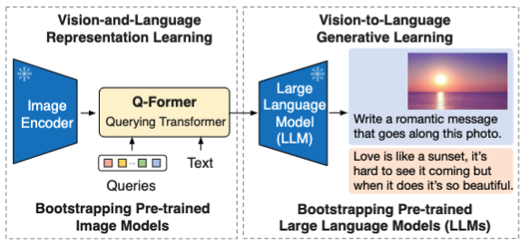

## BLIP-2: Bootstrapping Language-Image Pre-training with Frozen Image Encoders and Large Language Models
This is the official implementation of BLIP-2 [paper](https://arxiv.org/abs/2301.12597), a generic and efficient pre-training strategy that easily harvests development of pretrained vision models and large language models (LLMs) for vision-language pretraining. BLIP-2 beats Flamingo on zero-shot VQAv2 (**65.0** vs **56.3**), establishing new state-of-the-art on zero-shot captioning (on NoCaps **121.6** CIDEr score vs previous best **113.2**). Equipped with powerful LLMs (e.g. OPT, FlanT5), BLIP-2 also unlocks the new **zero-shot instructed vision-to-language generation** capabilities for various interesting applications!



### Install:
```
pip install salesforce-lavis
```
or install from source following LAVIS instruction.

### Demo:
Try out our [Notebook Demo](https://github.com/salesforce/LAVIS/blob/main/examples/blip2_instructed_generation.ipynb) on instructed vision-to-language generation: [](https://colab.research.google.com/github/salesforce/LAVIS/blob/main/examples/blip2_instructed_generation.ipynb)


### BLIP-2 Model Zoo 
```python
# ==================================================
# Architectures                  Types
# ==================================================
# blip2_opt                      pretrain_opt2.7b, caption_coco_opt2.7b, pretrain_opt6.7b, caption_coco_opt6.7b
# blip2_t5                       pretrain_flant5xl, caption_coco_flant5xl, pretrain_flant5xxl
# blip2                          pretrain, coco
```
- Use ```pretrained_{LLM}``` model types for zero-shot image-to-text generation with prompts.
- Use ```caption_coco_{LLM}``` model types to generate coco-style captions.
- Use ```blip2``` model architecture for image-text feature extraction and retrieval.

### Image-to-text Generation Example
Let’s see how to use BLIP-2 models to perform zero-shot instructed image-to-text generation. We first load a sample image from local.
```python
import torch
from PIL import Image
# setup device to use
device = torch.device("cuda") if torch.cuda.is_available() else "cpu"
# load sample image
raw_image = Image.open("../../docs/_static/merlion.png").convert("RGB")
display(raw_image.resize((596, 437)))
```

Then we load a pre-trained BLIP-2 model with its preprocessors (transforms).
```python
import torch
from lavis.models import load_model_and_preprocess
# loads BLIP-2 pre-trained model
model, vis_processors, _ = load_model_and_preprocess(name="blip2_t5", model_type="pretrain_flant5xxl", is_eval=True, device=device)
# prepare the image
image = vis_processors["eval"](raw_image).unsqueeze(0).to(device)
```

Given the image and a text prompt, ask the model to generate the response.
```python
model.generate({"image": image, "prompt": "Question: which city is this? Answer:"})
# 'singapore'
```

Ask the model to explain its answer.
```python
model.generate({
    "image": image,
    "prompt": "Question: which city is this? Answer: singapore. Question: why?"})
# 'it has a statue of a merlion'    
```


Ask a follow-up question.
```python
# prepare context prompt
context = [
    ("which city is this?", "singapore"),
    ("why?", "it has a statue of a merlion"),
]
question = "where is the name merlion coming from?"
template = "Question: {} Answer: {}."
prompt = " ".join([template.format(context[i][0], context[i][1]) for i in range(len(context))]) + " Question: " + question + " Answer:"
print(prompt)
# generate model's response
model.generate({"image": image,"prompt": prompt})
# 'merlion is a portmanteau of mermaid and lion'
```

### Feature Extraction Example
BLIP-2 supports the Unified Feature Extraction Interface of LAVIS. Checkout this [notebook](https://github.com/salesforce/LAVIS/blob/3446bac20c5646d35ae383ebe6d13cec4f8b00cb/examples/blip2_feature_extraction.ipynb) for an example.

### Image-Text Matching Example
BLIP-2 can compute the image-text matching score using the same interface as BLIP. Checkout this [notebook](https://github.com/salesforce/LAVIS/blob/3446bac20c5646d35ae383ebe6d13cec4f8b00cb/examples/blip2_image_text_matching.ipynb) for an example. 

### Benchmark Evaluation 
Follow [Dataset Download](https://opensource.salesforce.com/LAVIS//latest/getting_started.html#auto-downloading-and-loading-datasets) to prepare common vision-language datasets.

Run [these scripts](https://github.com/salesforce/LAVIS/tree/main/run_scripts/blip2/eval) for evaluating pretrained and finetuned models. 

### Training
Stage-1 Pre-training (from scratch): 
```bash run_scripts/blip2/train/pretrain_stage1.sh```

Stage-2 Pre-training: 
```bash run_scripts/blip2/train/pretrain_stage2.sh```

Finetune for image captioning: 
```bash run_scripts/blip2/train/train_caption_coco.sh```

The [config files](https://github.com/salesforce/LAVIS/tree/main/lavis/projects/blip2/train) can be modified for customized training.

### Citing BLIP-2
<pre>
@inproceedings{li2023blip2,
      title={{BLIP-2:} Bootstrapping Language-Image Pre-training with Frozen Image Encoders and Large Language Models}, 
      author={Junnan Li and Dongxu Li and Silvio Savarese and Steven Hoi},
      year={2023},
      booktitle={ICML},
}</pre>

###  🤗 Hugging Face integration

BLIP-2 is integrated into the Hugging Face 🤗 [Transformers](https://github.com/huggingface/transformers) library, and allows to leverage int8 quanitization thanks to [bitsandbytes](https://github.com/TimDettmers/bitsandbytes). This roughly halves the amount of memory required to load the model, without performance degradation.

Documentation can be found [here](https://huggingface.co/docs/transformers/main/model_doc/blip-2).

Usage in half precision (float16) is as follows:

```
from PIL import Image
import requests
from transformers import Blip2Processor, Blip2ForConditionalGeneration
import torch

device = "cuda" if torch.cuda.is_available() else "cpu"

processor = Blip2Processor.from_pretrained("Salesforce/blip2-opt-2.7b")
model = Blip2ForConditionalGeneration.from_pretrained(
    "Salesforce/blip2-opt-2.7b", torch_dtype=torch.float16
)
model.to(device)
url = "http://images.cocodataset.org/val2017/000000039769.jpg"
image = Image.open(requests.get(url, stream=True).raw)

inputs = processor(images=image, return_tensors="pt").to(device, torch.float16)

generated_ids = model.generate(**inputs)
generated_text = processor.batch_decode(generated_ids, skip_special_tokens=True)[0].strip()
print(generated_text)
```

To leverage the int8 algorithm, you can run the model as follows:

```
import torch
import requests
from PIL import Image
from transformers import Blip2Processor, Blip2ForConditionalGeneration

processor = Blip2Processor.from_pretrained("Salesforce/blip2-opt-2.7b")
model = Blip2ForConditionalGeneration.from_pretrained("Salesforce/blip2-opt-2.7b", load_in_8bit=True, device_map="auto")

img_url = 'https://storage.googleapis.com/sfr-vision-language-research/BLIP/demo.jpg' 
raw_image = Image.open(requests.get(img_url, stream=True).raw).convert('RGB')

question = "how many dogs are in the picture?"
inputs = processor(raw_image, question, return_tensors="pt").to("cuda", torch.float16)

out = model.generate(**inputs)
print(processor.decode(out[0], skip_special_tokens=True))
```

All models can be found on the [hub](https://huggingface.co/models?other=blip-2).
