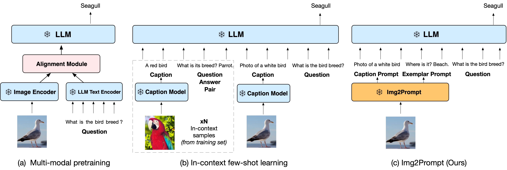
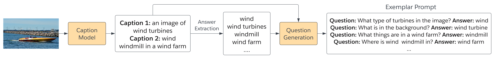
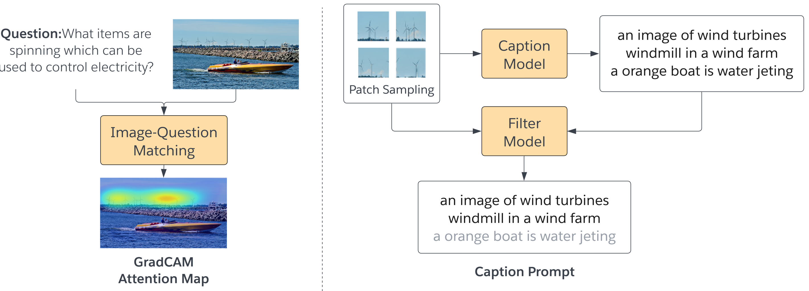

## From Images to Textual Prompts: Zero-shot VQA with Frozen Large Language Models

This is the official code for <a href="https://arxiv.org/abs/2212.10846">Img2LLM-VQA paper</a>. We integrate the implementation into LAVIS.

Large language models (LLMs) have demonstrated excellent zero-shot generalization to new tasks. However, effective utilization of LLMs for zero-shot visual question-answering (VQA) remains challenging, primarily due to the modality disconnection and task disconnection between LLM and VQA task. We propose **Img2LLM**, a plug-and-play module that provides the prompts that can bridge the these disconnections, so that LLMs can perform VQA tasks without end-to-end training.



The following images illustrate the technical procedures of answer extraction, question generation and caption prompts in Img2LLM. See paper for details.





### Demo
We include an interactive demo [Colab notebook](https://colab.research.google.com/github/salesforce/LAVIS/blob/main/projects/img2llm-vqa/img2llm_vqa.ipynb)
to show Img2LLM-VQA inference workflow:
1. Image-question matching: compute the relevancy score of the image patches wrt the question, and remove the generated noisy captions with low relevancy score.
2. Image captioning: generate question-guided captions based on the relevancy score.
3. Question Generation: generate questions based on the synthetic answers and captions.
4. Large Language Model: Pre-trained lagre language models, e.g. OPT/GPT-3

### Zero-Shot Evaluation
<table>
<thead>
  <tr>
    <th rowspan="2">Model</th>
    <th rowspan="2">End-to-End Training?</th>
    <th colspan="1">VQAv2 val</th>
    <th colspan="1">VQAv2 test</th>
    <th colspan="1">OK-VQA test</th>
    <th colspan="1">AOK-VQA val</th>
    <th colspan="1">AOK-VQA test</th>
  </tr>

</thead>
<tbody>
  <tr>
    <td> Frozen-7B<sub>base</sub> </td>
    <td> ✓ </td> 
    <td>29.5</td>
    <td>-</td>
    <td>5.9</td>
    <td>-</td>
<td>-</td>
  </tr>
<tr>
    <td> Flamingo-9B<sub>base</sub> </td>
    <td> ✓</td> 
    <td>-</td>
    <td>51.8</td>
    <td>44.7</td>
    <td>-</td>
<td>-</td>
  </tr>
  <tr>
    <td> Flamingo-80B<sub>base</sub> </td>
    <td>✓</td> 
    <td>-</td>
    <td>56.3</td>
    <td>50.6</td>
    <td>-</td>
<td>-</td>
  </tr>
  <tr>
    <td> Img2LLM-VQA-OPT<sub>13B</sub> </td>
<td> x</td> 
    <td>57.1</td>
    <td>57.3 </td>
    <td>39.9</td>
    <td>33.3</td>
<td>33.0</td>
  </tr>
  <tr>
    <td> Img2LLM-VQA-OPT<sub>30B</td>
<td> x</td> 
    <td>59.5</td>
    <td>60.4 </td>
    <td>41.8 </td>
    <td>36.9</td>
<td>36.0 </td>
  </tr>
  <tr>
    <td> Img2LLM-VQA-OPT<sub>66B</td>
<td> x</td> 
    <td>59.9</td>
    <td>60.3 </td>
    <td>43.2</td>
    <td>38.7</td>
<td>38.2</td>
  </tr>
  <tr>
   <td> Img2LLM-VQA-OPT<sub>175B</td>
<td> x</td> 
    <td>60.6</td>
    <td>61.9</td>
    <td>45.6</td>
    <td>42.9</td>
<td>40.7</td>
  </tr>
</tbody>
</table>

To reproduce these evaluation results of Img2LLM-VQA with different LLMs, you can follow this [folder](https://github.com/CR-Gjx/Img2LLM) :


### Citation
If you find this code to be useful for your research, please consider citing.
```bibtex
@misc{guo2023from,
  title={From Images to Textual Prompts: Zero-shot {VQA} with Frozen Large Language Models},
  author={Jiaxian Guo and Junnan Li and Dongxu Li and Anthony Tiong and Boyang Li and Dacheng Tao and Steven HOI},
  year={2023},
  url={https://openreview.net/forum?id=Ck1UtnVukP8}
}
```
