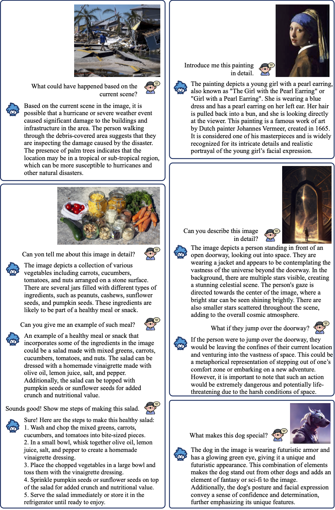
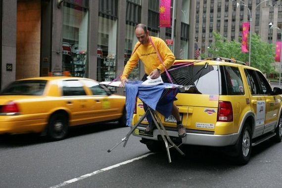
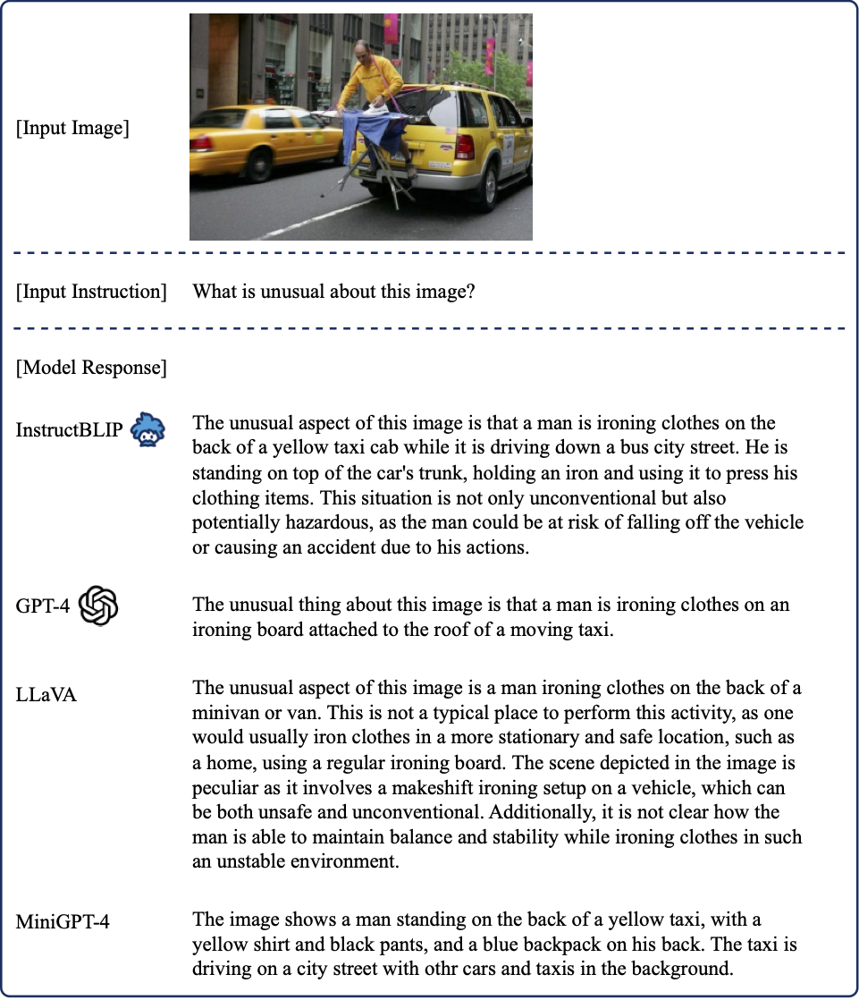

## InstructBLIP: Towards General-purpose Vision-Language Models with Instruction Tuning
This is the official implementation of InstructBLIP [paper](http://arxiv.org/abs/2305.06500). 
InstructBLIP proposes a new vision-language instruction-tuning framework using BLIP-2 models, achieving state-of-the-art zero-shot generalization performance on a wide range of vision-language tasks.



### Install from source:
```
git clone https://github.com/salesforce/LAVIS.git
cd LAVIS
pip install -e .
```
We will soon support installing InstructBLIP with PyPI


### InstructBLIP Model Zoo 
```python
# ==================================================
# Architectures                  Types
# ==================================================
# blip2_vicuna_instruct          vicuna7b, vicuna13b
# blip2_t5_instruct              flant5xl, flant5xxl
```

### Prepare Vicuna Weights
InstructBLIP uses frozen Vicuna 7B and 13B models. Please first follow the [instructions](https://github.com/lm-sys/FastChat) to prepare Vicuna v1.1 weights. 
Then modify the ```llm_model``` in the [Model Config](https://github.com/salesforce/LAVIS/blob/main/lavis/configs/models/blip2/blip2_instruct_vicuna7b.yaml) to the folder that contains Vicuna weights.


### Instruction-following Image-to-text Generation 
We first load a sample image from local.
```python
import torch
from PIL import Image
# setup device to use
device = torch.device("cuda") if torch.cuda.is_available() else "cpu"
# load sample image
raw_image = Image.open("../../docs/_static/Confusing-Pictures.jpg").convert("RGB")
display(raw_image.resize((596, 437)))
```


Then we load a InstructBLIP model with its preprocessors (transforms).
```python
from lavis.models import load_model_and_preprocess
# loads InstructBLIP model
model, vis_processors, _ = load_model_and_preprocess(name="blip2_vicuna_instruct", model_type="vicuna7b", is_eval=True, device=device)
# prepare the image
image = vis_processors["eval"](raw_image).unsqueeze(0).to(device)
```

Given the image and an instruction prompt, ask the model to generate the response.
```python
model.generate({"image": image, "prompt": "What is unusual about this image?"})
```
```
Output: "The unusual aspect of this image is that a man is ironing clothes on the back of a yellow SUV, which is parked in the middle of a busy city street. This is an unconventional approach to ironing clothes, as it requires the man to balance himself and his ironing equipment on top of the vehicle while navigating through traffic. Additionally, the presence of taxis and other vehicles in the scene further emphasizes the unusual nature of this situation. In general, ironing clothes is typically done in a more traditional setting, such as a laundry room or a designated ironing area at home or in a commercial laundry facility."
```

Generate a short description.
```python
model.generate({"image": image, "prompt": "Write a short description for the image."})
```
```
Output: "a man in a yellow shirt is standing on top of a car"
```

Generate a long description.
```python
model.generate({"image": image, "prompt": "Write a detailed description."})
```
```
Output: "A man in a yellow shirt is standing on the back of a yellow SUV parked on a busy city street. He is holding an ironing board and appears to be ironing clothes while standing on the vehicle's tailgate. There are several other cars and trucks visible in the background, adding to the bustling atmosphere of the scene. The man's presence on the back of the SUV creates a unique and creative way for him to do his laundry while commuting to work or running errands in the city."
```

Use nucleus sampling instead of beam search.
```python
model.generate({"image": image, "prompt":"Describe the image in details."}, use_nucleus_sampling=True, top_p=0.9, temperature=1)
```
```
Output: "In the city street, a man in a yellow shirt is ironing clothes on top of his car, which is parked on the side of the road. He is surrounded by other vehicles, including a taxi cab and a truck, adding to the bustling atmosphere of the urban environment. The man's task requires him to balance precariously on the back of his car as he works on his laundry, highlighting the creativity and resourcefulness of New Yorkers in their daily lives."
```

### Demo
Run Gradio Demo locally with ```python run_demo.py```

### Instruction-Tuning
In order to train the model with instruction data, prepare the dataset where each sample contains three items: "image", "text_input", and "text_output". Follow LAVIS documentation for running model training.

### Qualitative Comparison with Concurrent Multimodal Models (e.g., GPT-4)

The response from InstructBLIP is more comprehensive than GPT-4, more visually-grounded than LLaVA, and more logical than MiniGPT-4. The responses of GPT-4 and LLaVA
are obtained from their respective papers, while the official demo is used for MiniGPT-4.



### BibTeX
```
@misc{instructblip,
      title={InstructBLIP: Towards General-purpose Vision-Language Models with Instruction Tuning}, 
      author={Wenliang Dai and Junnan Li and Dongxu Li and Anthony Meng Huat Tiong and Junqi Zhao and Weisheng Wang and Boyang Li and Pascale Fung and Steven Hoi},
      year={2023},
      eprint={2305.06500},
      archivePrefix={arXiv},
      primaryClass={cs.CV}
}
```
### Usage and License: 
The model is intended and licensed for research use only. InstructBLIP w/ Vicuna models are restricted to uses that follow the license agreement of LLaMA and Vicuna. The models have been trained on the [LLaVA](https://llava-vl.github.io/) dataset which is CC BY NC 4.0 (allowing only non-commercial use).
