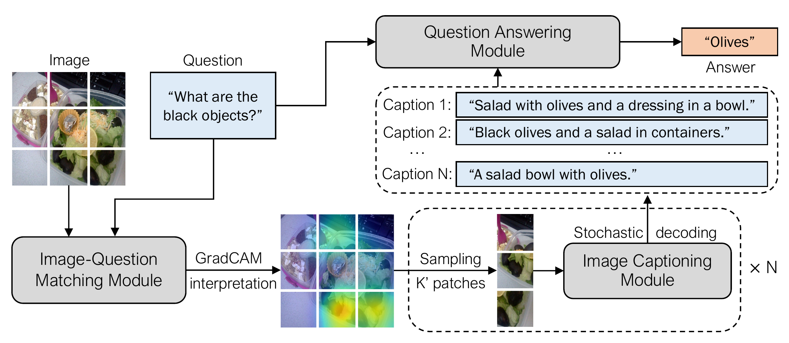

## Plug-and-Play VQA: Zero-shot VQA by Conjoining Large Pretrained Models with Zero Training



This is the code for <a href="https://arxiv.org/abs/2210.08773">PNP-VQA paper</a>. We integrate the implementation into LAVIS.

### Demo
We include an interactive demo [Colab notebook](https://colab.research.google.com/github/salesforce/LAVIS/blob/main/projects/pnp-vqa/pnp_vqa.ipynb)
to show PNP-VQA inference workflow:
1. Image-question matching: compute the relevancy score of the image patches wrt the question.
2. Image captioning: generate question-guided captions based on the relevancy score.
3. Question answering: answer the question by using the captions.

### Evaluation
<table>
<thead>
  <tr>
    <th rowspan="2">Model</th>
    <th colspan="2">VQAv2 val</th>
    <th colspan="2">VQAv2 test</th>
    <th colspan="2">OK-VQA test</th>
    <th colspan="2">GQA test-dev</th>
  </tr>
  <tr>
    <th>Paper</th>
    <th>LAVIS</th>
    <th>Paper</th>
    <th>LAVIS</th>
    <th>Paper</th>
    <th>LAVIS</th>
    <th>Paper</th>
    <th>LAVIS</th>
  </tr>
</thead>
<tbody>
  <tr>
    <td> PNP-VQA<sub>base</sub> </td>
    <td>54.3</td>
    <td>54.2</td>
    <td>55.2</td>
    <td>55.3</td>
    <td>23.0</td>
    <td>23.3</td>
    <td>34.6</td>
    <td>34.9</td>
  </tr>
  <tr>
    <td> PNP-VQA<sub>large</sub> </td>
    <td>57.5</td>
    <td>57.5</td>
    <td>58.8</td>
    <td>58.9</td>
    <td>27.1</td>
    <td>27.1</td>
    <td>38.4</td>
    <td>38.4</td>
  </tr>
  <tr>
    <td> PNP-VQA<sub>3B</sub> </td>
    <td>62.1</td>
    <td>62.1</td>
    <td>63.5</td>
    <td>63.5</td>
    <td>34.1</td>
    <td>34.0</td>
    <td>42.3</td>
    <td>42.3</td>
  </tr>
</tbody>
</table>

To reproduce these evaluation results of PNP-VQA with different sizes, following steps below:

#### Navigate to the root directory
```bash
cd LAVIS
```

#### VQAv2 Val
```bash
bash run_scripts/pnp-vqa/eval/eval_vqav2.sh ## 54.2
bash run_scripts/pnp-vqa/eval/eval_vqav2_large.sh ## 57.5
bash run_scripts/pnp-vqa/eval/eval_vqav2_3b.sh ## 62.1
```

#### VQAv2 Test
```bash
bash run_scripts/pnp-vqa/eval/eval_vqav2_test.sh ## 55.3
bash run_scripts/pnp-vqa/eval/eval_vqav2_test_large.sh ## 58.9
bash run_scripts/pnp-vqa/eval/eval_vqav2_test_3b.sh ## 63.5
```

#### OK-VQA Test
```bash
bash run_scripts/pnp-vqa/eval/eval_okvqa.sh ## 23.3
bash run_scripts/pnp-vqa/eval/eval_okvqa_large.sh ## 27.1
bash run_scripts/pnp-vqa/eval/eval_okvqa_3b.sh ## 34.0
```

#### GQA Test-dev
```bash
bash run_scripts/pnp-vqa/eval/eval_gqa.sh ## 34.9
bash run_scripts/pnp-vqa/eval/eval_gqa_large.sh ## 38.4
bash run_scripts/pnp-vqa/eval/eval_gqa_3b.sh ## 42.3
```

### Citation
If you find this code to be useful for your research, please consider citing.
```bibtex
@article{tiong2022plug,
  title={Plug-and-Play VQA: Zero-shot VQA by Conjoining Large Pretrained Models with Zero Training},
  author={Tiong, Anthony Meng Huat and Li, Junnan and Li, Boyang and Savarese, Silvio and Hoi, Steven CH},
  journal={arXiv preprint arXiv:2210.08773},
  year={2022}
}
```
